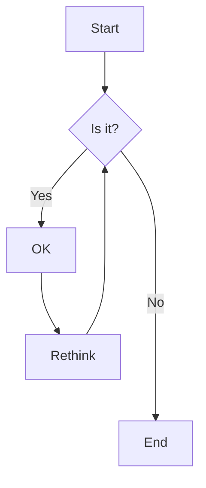
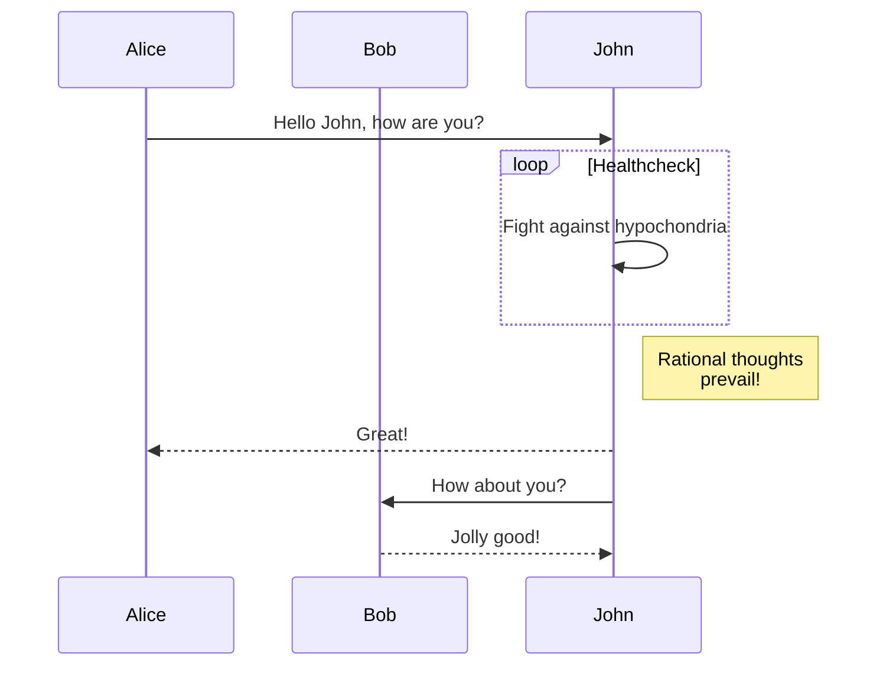
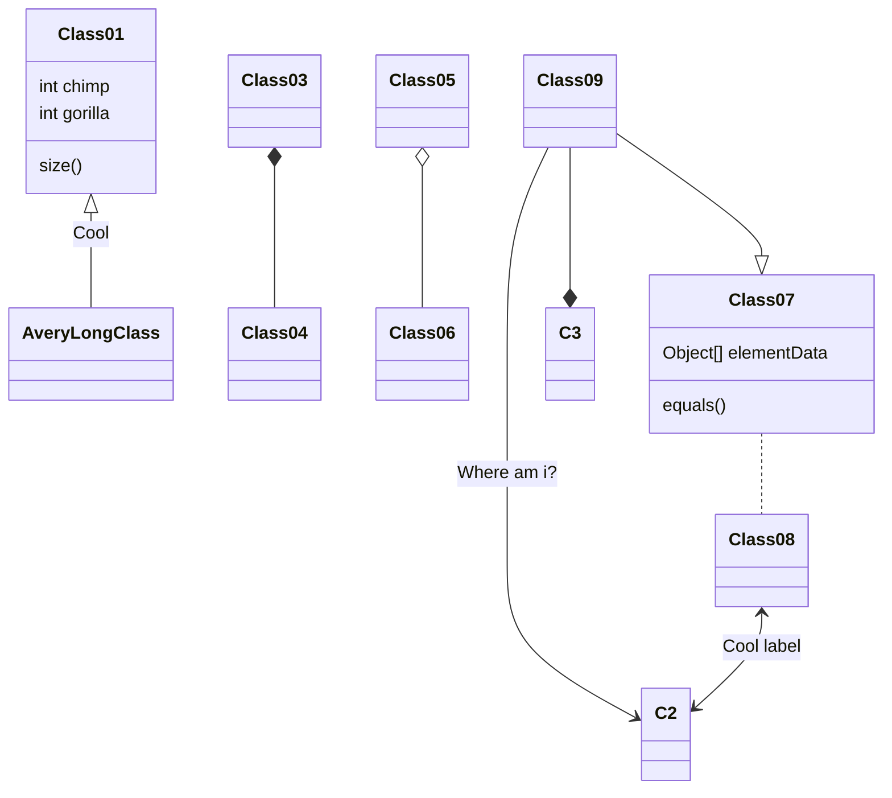
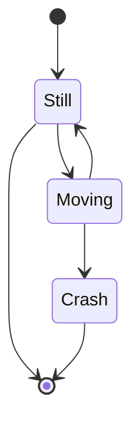
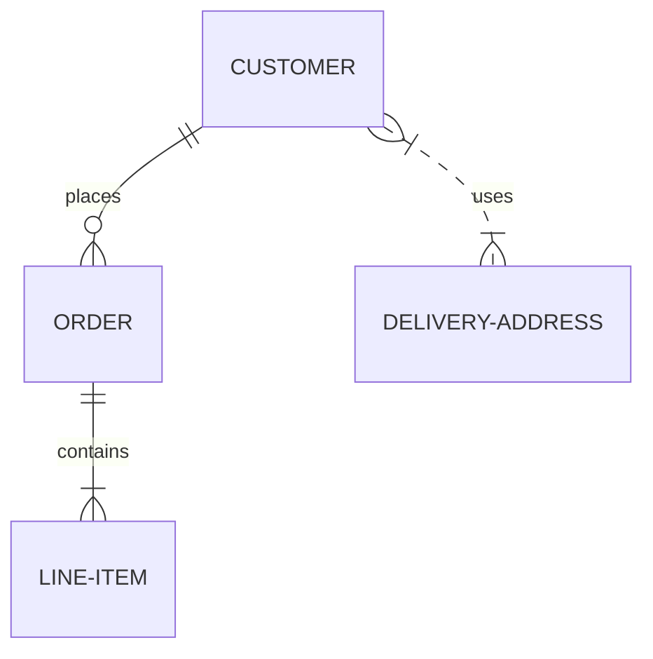
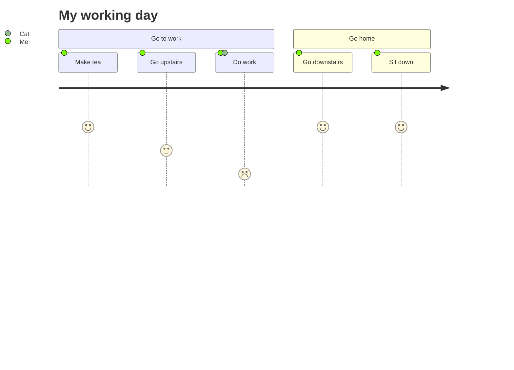
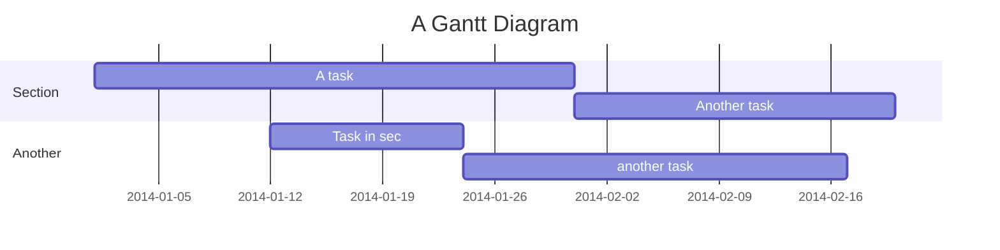
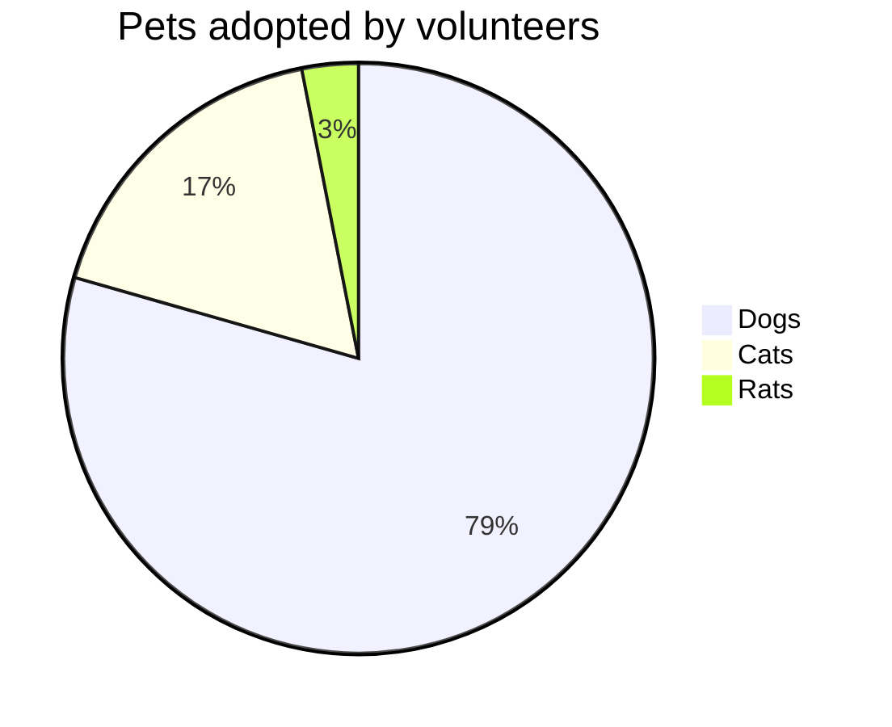

# Markdown Kitchen Sink

This is a comprehensive test page to verify how various markdown elements render on the website.

---

## Images

### Regular Image


### Image with Title


### Linked Image

[](https://example.com)

---

## Embedded Media (Auto-embed from Links)

Just paste standalone links to YouTube, Vimeo, Giphy, or Tenor on their own line:

### YouTube Video

https://www.youtube.com/watch?v=dQw4w9WgXcQ

### Vimeo Video

https://vimeo.com/1168555141?fl=wc

### Giphy GIF (Standard)

https://giphy.com/gifs/reaction-giff-vulture-NB51jI9mjEj7OlDjXN

### Giphy GIF (Direct Media URL with v1 API)

https://media.giphy.com/media/v1.Y2lkPTc5MGI3NjExdTNuc2QyYXpiMWt3NXBkZmFzcGVvOHo0MzF3aHE2MngwZzNqY3V6YyZlcD12MV9naWZzX3NlYXJjaCZjdD1n/g7GKcSzwQfugw/giphy.gif

### Tenor GIF (View Page)

https://tenor.com/view/happy-gif-27563888

### Tenor GIF (Direct Media URL)

https://media1.tenor.com/m/x8v1oNUOmg4AAAAd/rickroll-roll.gif

### YouTube Shorts 🎵

https://www.youtube.com/shorts/41iWg91yFv0

---

## Mathematical Expressions (KaTeX)

Inline math: $E = mc^2$

Block math:

$$
\int_{-\infty}^{\infty} e^{-x^2} dx = \sqrt{\pi}
$$

More examples:

$$
\sum_{i=1}^{n} x_i = x_1 + x_2 + \cdots + x_n
$$

$$
\frac{d}{dx}\left( \int_{0}^{x} f(u) \, du\right) = f(x)
$$

---

## Abbreviations

_[HTML]: HyperText Markup Language
_[CSS]: Cascading Style Sheets

HTML and CSS are web technologies.

---

## Mermaid Charts

### Flowchart



### Sequence Diagram



### Class Diagram



### State Diagram



### Entity Relationship Diagram



### User Journey



### Gantt Chart



### Pie Chart



---

## Typography

### Headers

# H1 Heading

## H2 Heading

### H3 Heading

#### H4 Heading

##### H5 Heading

###### H6 Heading

### Paragraphs

This is a regular paragraph. Lorem ipsum dolor sit amet, consectetur adipiscing elit. Sed do eiusmod tempor incididunt ut labore et dolore magna aliqua. Ut enim ad minim veniam, quis nostrud exercitation ullamco laboris.

This is another paragraph. **Bold text** and _italic text_ and **_bold italic text_**. You can also use **underscores** for _italics_ and **_bold italics_**.

### Links

[Internal link](/)
[External link](https://example.com)
[Link with title](https://example.com "Example Website")
[Email link](mailto:example@example.com)

---

## Lists

### Unordered Lists

- First item
- Second item
- Third item
  - Nested item 1
  - Nested item 2
    - Deep nested item
- Fourth item

### Ordered Lists

1. First item
2. Second item
3. Third item
   1. Nested ordered item
   2. Another nested item
4. Fourth item

### Mixed Lists

1. First ordered item
   - Unordered sub-item
   - Another sub-item
2. Second ordered item
   1. Ordered sub-item
   2. Another ordered sub-item

### Task Lists

- [x] Completed task
- [ ] Unchecked task
- [x] Another completed task
- [ ] Another unchecked task

---

## Blockquotes

> This is a simple blockquote. It can contain **formatted text** and [links](https://example.com).

> This is a multi-paragraph blockquote.
>
> It has multiple paragraphs separated by blank lines.

> Nested blockquotes:
>
> > This is a nested quote.
> > It can go deeper.
> >
> > > Even deeper nested quote.

> ##### Blockquote with a heading
>
> And some regular text below it.

---

## Code

### Inline Code

Use `console.log()` for debugging. Variables like `myVariable` should be camelCase.

### Code Blocks

#### Without language

```
This is a plain code block
with multiple lines
of text
```

#### JavaScript

```javascript
function greet(name) {
  const message = `Hello, ${name}!`;
  console.log(message);
  return message;
}

greet("World");
```

#### TypeScript

```typescript
interface User {
  id: number;
  name: string;
  email: string;
}

function getUser(id: number): User | undefined {
  return users.find(u => u.id === id);
}
```

#### Python

```python
def fibonacci(n):
    if n <= 1:
        return n
    return fibonacci(n - 1) + fibonacci(n - 2)

for i in range(10):
    print(f"F({i}) = {fibonacci(i)}")
```

#### CSS

```css
.container {
  display: flex;
  justify-content: center;
  align-items: center;
  padding: 1rem;
  background: linear-gradient(45deg, #ff6b6b, #4ecdc4);
}
```

#### HTML

```html
<!DOCTYPE html>
<html lang="en">
  <head>
    <meta charset="UTF-8" />
    <title>Example</title>
  </head>
  <body>
    <h1>Hello World</h1>
    <p>This is an example.</p>
  </body>
</html>
```

#### Bash/Shell

```bash
#!/bin/bash

echo "Installing dependencies..."
npm install

echo "Building project..."
npm run build

echo "Done!"
```

---

## Tables

### Simple Table

| Header 1 | Header 2 | Header 3 |
| -------- | -------- | -------- |
| Cell 1   | Cell 2   | Cell 3   |
| Cell 4   | Cell 5   | Cell 6   |
| Cell 7   | Cell 8   | Cell 9   |

### Aligned Table

| Left Aligned | Center Aligned | Right Aligned |
| :----------- | :------------: | ------------: |
| Left         |     Center     |         Right |
| Lorem        |     Ipsum      |         Dolor |
| Foo          |      Bar       |           Baz |

### Table with Formatting

| Feature                     | Status     | Notes             |
| --------------------------- | ---------- | ----------------- |
| **Bold**                    | ✅ Working | _Italic note_     |
| `code`                      | 🚧 Beta    | Normal text       |
| [Link](https://example.com) | ❌ Broken  | ~~Strikethrough~~ |

---

## Horizontal Rules

Here's a standard horizontal rule:

---

Here's one with asterisks:

---

Here's one with underscores:

---

---

## HTML Elements

### Details/Summary

<details>
  <summary>Click to expand</summary>
  
  This content is hidden by default.
  
  - Can contain
  - markdown
  - lists
  
</details>

### Keyboard

Press <kbd>Ctrl</kbd> + <kbd>C</kbd> to copy.
Press <kbd>Ctrl</kbd> + <kbd>V</kbd> to paste.

---

## Emojis

Unicode emojis: 🎉 🚀 💯 🔥 ✨ 🌟

---

## Definition Lists

Term 1
: Definition 1

Term 2
: Definition 2a
: Definition 2b

---

## Footnotes

Here's some text with a footnote[^1]. And another footnote[^2].

[^1]: This is the first footnote.

[^2]: This is the second footnote with more details.

---

## Strikethrough and Subscript/Superscript

~~This text is crossed out.~~

H~2~O is water (subscript).

E=mc^2^ (superscript).

---

## End

That's the end of the kitchen sink! 🎊
