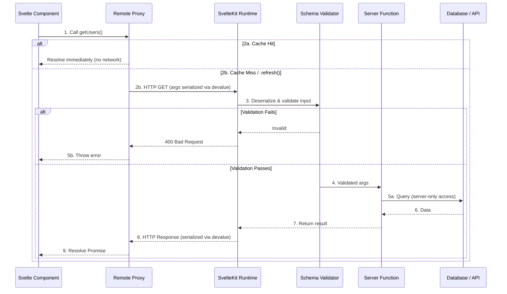

## Table of contents

## Header Image

After [Svelte's](https://svelte.dev) experimental support for [**await**](https://svelte.dev/docs/svelte/await-expressions), which gave us more control over how we load data, the concept of remote functions was first introduced [here](https://github.com/sveltejs/svelte/discussions/15845).
One thing led to another, and it paved the way for the [remote functions](https://github.com/sveltejs/kit/discussions/13897) discussions.

Since then, it has evolved significantly and, in my opinion, is nearly mature enough to exit the experimental phase.

Does this mean we can forget about [loaders](https://svelte.dev/docs/kit/load) and [actions](https://svelte.dev/docs/kit/form-actions)? **Not quite.** Many projects started two years ago heavily rely on them, often in combination with [sveltekit-superforms](https://superforms.rocks/), which provides a best-in-class developer experience for form handling and validation.

However, Remote Functions introduce a fundamentally new way to think about client-server communication in SvelteKit. They are a tool for type-safe communication between client and server. They can be _called_ anywhere in your app but always _run_ on the server, meaning they can safely access server-only modules containing things like environment variables and database clients.

Combined with Svelte 5's experimental support for `await`, they allow you to load and manipulate data directly inside your components! Let's explore how they work.

## Enabling Remote Functions

Currently, remote functions are an experimental feature. To opt in, you need to update your `svelte.config.js`:

```js {16-18, 25-27}
// svelte.config.js
import adapter from "@sveltejs/adapter-auto";
import { relative, sep } from "node:path";

/** @type {import('@sveltejs/kit').Config} */
const config = {
  compilerOptions: {
    // defaults to rune mode for the project, except for `node_modules`. Can be removed in svelte 6.
    runes: ({ filename }) => {
      const relativePath = relative(import.meta.dirname, filename);
      const pathSegments = relativePath.toLowerCase().split(sep);
      const isExternalLibrary = pathSegments.includes("node_modules");

      return isExternalLibrary ? undefined : true;
    },
    experimental: {
      async: true,
    },
  },
  kit: {
    // adapter-auto only supports some environments, see https://svelte.dev/docs/kit/adapter-auto for a list.
    // If your environment is not supported, or you settled on a specific environment, switch out the adapter.
    // See https://svelte.dev/docs/kit/adapters for more information about adapters.
    adapter: adapter(),
    experimental: {
      remoteFunctions: true,
    },
  },
};

export default config;
```

## Query and Prerender

I don't want to steal the thunder of the [documentation](https://svelte.dev/docs/kit/remote-functions#Overview)
but to use remote functions we need to export the functions through a
`.remote.ts` file (or `.remote.js` for those who prefer JavaScript).
You can place this in your route directory; a common convention is naming it **`src/routes/[your-path]/users.remote.ts`**.

### query

The `query` function is used for reading dynamic data from the server. Here is how the data flows through the different layers:



### The Internal Flow (Step-by-Step)

When you call a `query` function from a Svelte component on the client, you are interacting with a reactive **Remote Proxy** that manages a network bridge. Here is the exact sequence of events:

1.  **The Proxy Wrapper & Cache Check:** During the build process, SvelteKit transforms your `.remote.ts` exports into a generated proxy. When you call a proxy, it generates a cache key based on the serialized arguments.
2.  **Evaluating the Cache (2a vs 2b):**
    - **2a. Cache Hit:** If the proxy finds an existing result for your specific arguments in its internal memory cache, it resolves the data immediately without a network request. Because queries are cached while they are active on the page, the proxy ensures that identical calls with identical arguments share the same data.
    - **2b. Cache Miss (or manually calling `.refresh()`):** If no cached result exists, or if you manually invoke `.refresh()` on an existing query, the proxy transitions into a `loading` state and initiates a network request to fetch fresh data.
3.  **Serialization (via [`devalue`](https://github.com/sveltejs/devalue)):** The proxy uses **`devalue`** to serialize your arguments. Unlike JSON, `devalue` allows sending complex data types (like `Date`, `Map`) that the server can reconstruct perfectly.
4.  **The Hidden Endpoint:** The request is sent to a hidden SvelteKit runtime endpoint. For a standard `query`, this is sent as an **HTTP GET** request with the serialized arguments in the URL.
5.  **Validation Boundary:** Upon reaching the server, SvelteKit extracts the payload and passes it to the function wrapper generated by `$app/server`. It deserializes the arguments and runs them through your **Schema Validation** (Zod, Valibot, etc.) before your logic executes.
6.  **Server Execution:** If validation passes, your code runs in a **secure server environment**. Here, you have access to your database and the `RequestEvent` via `getRequestEvent()`.
7.  **Response & Deserialization:** The result is serialized back via `devalue`. On the client, the proxy receives the response, deserializes it, and resolves the returned Promise. Your `await getUsers()` expression completes, and the UI automatically renders with the fresh data!

The following snippet will serve as our base query, which we will enhance later.

```typescript collapse={5-25}
// src/routes/users/users.remote.ts
import { query } from "$app/server";

export type User = {
  id: number;
  name: string;
  username: string;
  email: string;
  address: {
    street: string;
    suite: string;
    city: string;
    zipcode: string;
    geo: {
      lat: string;
      lng: string;
    };
  };
  phone: string;
  website: string;
  company: {
    name: string;
    catchPhrase: string;
    bs: string;
  };
};

export const getUsers = query(async () => {
  const response = await fetch("https://jsonplaceholder.typicode.com/users");
  const users: User[] = await response.json();
  return users;
});
```

There are multiple ways to use a query function:

### 1. SSR

This is similar to the classic [`loader`](https://svelte.dev/docs/kit/load) approach using `+page.server.ts`:

```svelte
<!-- src/routes/users/+page.svelte -->
<script lang="ts">
	import { getUsers } from './users.remote';
</script>

<h1>Users</h1>
<ul>
	{#each await getUsers() as user (user.id)}
    <!-- This is typesafe -->
		<li>{user.name}</li>
	{/each}
</ul>
```

You might think there's nothing special about this—isn't it just a wrapped fetch request? Perhaps. We can achieve something similar using the new `await` expressions without extra files by fetching directly within the page.

```svelte
<!-- src/routes/await-users/+page.svelte -->
<script lang="ts">
  import { type User } from "./users.remote";

  async function getUsers() {
    const response = await fetch("https://jsonplaceholder.typicode.com/users");
    const data: User[] = await response.json();
    return data;
  }
</script>

<h1>Users</h1>
<ul>
  {#each await getUsers() as user (user.id)}
    <li>{user.name}</li>
  {/each}
</ul>
```

When an error occurs and the promise can't resolve, it will find the closest [`<svelte:boundary>`](https://svelte.dev/docs/svelte/svelte-boundary). This special element allows you to handle rendering errors. It also provides a way to utilize the special rune [`$effect.pending()`](https://svelte.dev/docs/svelte/$effect#$effect.pending), though in this case, the data will no longer be server-side rendered.

```svelte
<!-- src/routes/boundary-users/+page.svelte -->
<script lang="ts">
  import { getUsers } from "./users.remote";
</script>

<h1>Users</h1>

<svelte:boundary>
  {#snippet failed(error, reset)}
    <p>{error}</p>
    <button onclick={reset}>Try again</button>
  {/snippet}

  <ul>
    {#each await getUsers() as user (user.id)}
      <li>{user.name}</li>
    {/each}
  </ul>

  {#snippet pending()}
    Loading...
  {#/snippet}
</svelte:boundary>
```

### 2. Controlled

This is similar to the [`Streaming`](https://svelte.dev/docs/kit/load#Streaming-with-promises) concept using skeletons. Use this only for large datasets to avoid long initial load times. Generally, prefer SSR, as skeletons don't always provide the best UX.

To demonstrate this, let's modify `users.remote.ts` to throw an error:

```typescript ins={3, 10-12}
// src/routes/users/users.remote.ts
import { query } from "$app/server";
import { error } from "@sveltejs/kit";

export type User = {
  //...
};

export const getUsers = query(async () => {
  if (Math.random() > 0.5) {
    error(500, "Internal server error");
  }

  const response = await fetch("https://jsonplaceholder.typicode.com/users");
  const users: User[] = await response.json();
  return users;
});
```

The component:

```svelte ins={7-12,18}
<!-- src/routes/users/+page.svelte -->
<script lang="ts">
  import { getUsers } from "./users.remote";
</script>

<h1>Users</h1>
{#if getUsers().loading}
  Loading...
{:else if getUsers().error}
  Something went wrong
  <button onclick={() => getUsers().refresh()}>Try Again</button>
{:else}
  <ul>
    {#each getUsers().current as user (user.id)}
      <li>{user.name}</li>
    {/each}
  </ul>
{/if}
```

If you prefer to handle this manually, here is how you can mimic the behavior of `query`:

```svelte ins={3,6-8,11-18,24-30,33-35,39-44,50} del={23}
<!-- src/routes/await-users/+page.svelte -->
<script lang="ts">
  import { onMount } from "svelte";
  import { type User } from "./users.remote";

  let loading = $state(true);
  let error = $state(false);
  let users = $state<User[]>([]);

  async function getUsers() {
    error = false;
    loading = true;

    try {
      if (Math.random() > 0.5) {
        throw Error("Something went wrong");
      }

      const response = await fetch(
        "https://jsonplaceholder.typicode.com/users",
      );
      const data: User[] = await response.json();
      // return data;

      users = data;
    } catch {
      error = true;
    } finally {
      loading = false;
    }
  }

  onMount(() => {
    getUsers();
  });
</script>

<h1>Users</h1>
{#if loading}
  Loading...
{:else if error}
  Something went wrong
  <button onclick={() => getUsers()}>Try Again</button>
{:else}
  <ul>
    {#each users as user (user.id)}
      <li>{user.name}</li>
    {/each}
  </ul>
{/if}
```

### Beyond Simple Fetching: Built-in Validation

One of the most powerful features of remote functions is their native support for input validation. In a world where we must safeguard our APIs against potentially malicious or malformed input—since we should never trust user-provided data—remote functions provide a built-in validation layer.

The first argument of the `query` (or `prerender`) function accepts a [Standard Schema](https://standardschema.dev/) for validation. This ensures that your server-side logic only executes if the input matches your expectations.

The following examples use the "controlled" approach we discussed earlier:

```typescript
// src/routes/users/users.remote.ts
import * as v from "valibot";
import { query } from "$app/server";
import { error } from "@sveltejs/kit";

export type User = {
  //.. user fields
};

export const getUsers = query(
  v.object({
    name: v.optional(v.string()),
  }),
  async ({ name }) => {
    const response = await fetch("https://jsonplaceholder.typicode.com/users");
    const users: User[] = await response.json();
    const filtered = users.filter(user => user.name.includes(name ?? ""));

    if (filtered.length === 0) return [];

    return filtered;
  }
);
```

Now, when calling `getUsers` in our component, SvelteKit will enforce these types:

```svelte
<!-- src/routes/users/+page.svelte -->
<script lang="ts">
  import { getUsers } from "./users.remote";
  let name = $state<string>("");
</script>

<h1>Users</h1>
<input type="text" bind:value={name} />

{#if getUsers({ name }).loading}
  <p>Loading...</p>
{:else if getUsers({ name }).error}
  Something went wrong
  <button onclick={() => getUsers({ name }).refresh()}>Try Again</button>
{:else}
  <ul>
    {#each getUsers({ name }).current as user (user.id)}
      <li>{user.name}</li>
    {/each}
  </ul>
{/if}
```

If you accidentally pass incorrect data—for example, by setting an input type to `number` when a string is expected—both your server terminal and browser console will log a validation error:

```
Remote function schema validation failed: [
  {
    kind: 'schema',
    type: 'string',
    input: null,
    expected: 'string',
    received: 'null',
    message: 'Invalid type: Expected string but received null',
    ...
  }
]
```

To provide a better user experience, you should [handle validation errors](https://svelte.dev/docs/kit/remote-functions#Handling-validation-errors) properly using the `handleValidationError` hook:

```typescript
// src/hooks.server.ts
import type { HandleValidationError } from "@sveltejs/kit";

export const handleValidationError: HandleValidationError = ({
  event,
  issues,
}) => {
  return {
    message: "Invalid input",
    errors: issues,
  };
};
```

```typescript
// src/app.d.ts
import type { StandardSchemaV1 } from "@standard-schema/spec";

// See https://svelte.dev/docs/kit/types#app.d.ts
// for information about these interfaces
declare global {
  namespace App {
    interface Error {
      message: string;
      errors: Array<StandardSchemaV1.Issue>;
    }
    // interface Locals {}
    // interface PageData {}
    // interface PageState {}
    // interface Platform {}
  }
}

export {};
```

With this in place, you can catch and display validation errors directly in your UI:

```svelte
<!-- src/routes/users/+page.svelte -->
<script lang="ts">
  import { getUsers } from "./users.remote";
  let name = $state<string>("");
</script>

<h1>Users</h1>

<!-- Passing a number where a string is expected will trigger our error handling -->
<input type="number" bind:value={name} />

{#if getUsers({ name }).loading}
  <p>Loading...</p>
{:else if getUsers({ name }).error}
  {@const error = getUsers({ name }).error.body as App.Error}
  {#each error.errors as err (err.path)}
    <p>
      {err.message}
    </p>
  {/each}
  <p>
    <button onclick={() => getUsers({ name }).refresh()}> Try Again</button>
  </p>
{:else}
  <ul>
    {#each getUsers({ name }).current as user (user.id)}
      <li>{user.name}</li>
    {/each}
  </ul>
{/if}

```

Depending on your requirements, Standard Schema should cover most edge cases. Here is the approach.

```svelte
<!-- src/routes/users/+page.svelte -->
<script lang="ts">
  import { listUsersQuery } from "./users.remote";

  let name = $state<string>("");

  let usersQuery = listUsersQuery({ name });
  let users = usersQuery.current;
</script>
<h1>Users</h1>
<input type="text" bind:value={name} />

{#if usersQuery.loading}
  <p>Loading...</p>
{:else if usersQuery.error}
  {@const error = usersQuery.error.body as App.Error}
  {#each error.errors as err (err.path)}
    <p>
      {err.message}
    </p>
  {/each}
  <p>
    <button onclick={() => usersQuery.refresh()}> Try Again</button>
  </p>
{:else}
  <ul>
    {#each users as user (user.id)}
      <li>{user.name}</li>
    {/each}
  </ul>
{/if}
```

---

### query.batch

If you have a page with multiple components, each needing to fetch its own data (the classic N+1 problem), `query.batch` is an ideal solution. It groups multiple calls that happen within the same macrotask into a single server request.

On the server, your function receives an array of all requested arguments:

```typescript
// src/routes/users/users.remote.ts
export const getUser = query.batch(v.number(), async ids => {
  const response = await fetch("https://jsonplaceholder.typicode.com/users");
  const allUsers: User[] = await response.json();
  const filtered = allUsers.filter(u => ids.includes(u.id));

  // Return a function that maps the ID back to the specific result
  return id => filtered.find(u => u.id === id);
});
```

On the client, you use it just like a normal query. SvelteKit handles the grouping automatically!

```svelte
<!-- src/routes/users/UserBadge.svelte -->
<script lang="ts">
  import { getUser } from "./users.remote";
  let { id } = $props();
</script>

{#each await getUser(id) as user}
  <span>{user.name}</span>
{/each}
```

---

### prerender

For static data that only changes at build time, you can use `prerender`. It works just like `query`, but it resolves during the build process.

```ts
// src/routes/users/users.remote.ts
import { prerender } from "$app/server";

// ...

export const listUsersPrerender = prerender(
  v.object({
    name: v.optional(v.string()),
  }),
  async ({ name }) => {
    const response = await fetch("https://jsonplaceholder.typicode.com/users");
    const users: User[] = await response.json();
    const filtered = users.filter(user => user.name.includes(name ?? ""));

    if (filtered.length === 0) return [];

    return filtered;
  }
);
```

```svelte
<!-- src/routes/users/prerender.svelte -->
<script lang="ts">
  import { listUsersPrerender } from "./users.remote";

  let users = await listUsersPrerender({ name: "a" });
</script>

<h1>Users Prerendered</h1>

<ul>
  {#each users as user (user.id)}
    <li>{user.name}</li>
  {/each}
</ul>
```

This is incredibly powerful for partial prerendering. You can use `prerender` functions on pages that are otherwise dynamic. In the browser, the data is saved using the `Cache` API, which survives page reloads and only clears when you deploy a new version of your app.

If you have arguments, you can specify which ones to prerender using the `inputs` option:

```ts
export const getPost = prerender(
  v.string(),
  async slug => {
    /* ... */
  },
  {
    inputs: () => ["first-post", "second-post"],
    dynamic: true, // Allows falling back to a dynamic query for non-prerendered slugs
  }
);
```

This ensures that your most important content is served instantly from a CDN while still allowing for the full flexibility of a dynamic application.

### CDN Deployment

Since prerendered data is static, it can be served directly from a CDN or storage bucket. You can configure this in your `svelte.config.js` using the `paths.assets` option:

```js
// svelte.config.js
export default {
  kit: {
    paths: {
      assets: "https://static.example.com",
    },
  },
};
```

SvelteKit generates immutable data files (serialized with `devalue`) for every discovered call. These files are moved to your final build output (usually under a hidden path like `__remote/`) and should be uploaded to your CDN alongside your images and scripts. In the browser, the remote proxy will automatically fetch these files from your CDN instead of hitting your application server.

## Final Thoughts

Remote functions represent an exciting shift in how we handle client-server communication in SvelteKit. By abstracting away the endpoint wiring and allowing us to define data requirements directly alongside our components, they make the framework feel more unified and "full-stack" than ever before.

Does this mean we should ditch `load` functions and `actions` immediately? **Probably not.** Standard loaders are still the gold standard for critical page data, and tools like `sveltekit-superforms` remain the best choice for complex forms. However, for many use cases where you need type-safe, component-driven data fetching or simple mutations, remote functions are a breath of fresh air.

As they move towards a stable release, I expect them to become a core part of the SvelteKit developer's toolkit. Keep an eye on the experimental flags—the future of SvelteKit looks very bright!
