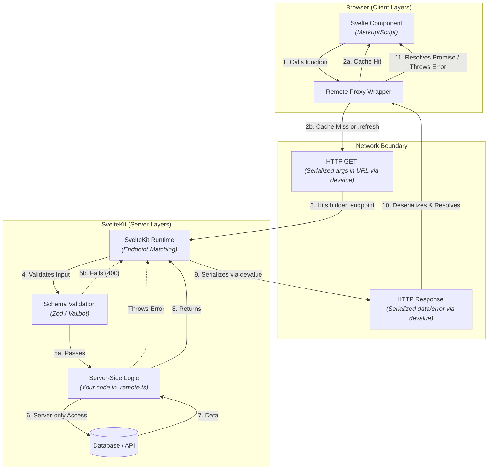

After [svelte's](https://svelte.dev) experimental support for [**await**](https://svelte.dev/docs/svelte/await-expressions)
which gave us more control over the concepts of loading data, it was all first introduced [here](https://github.com/sveltejs/svelte/discussions/15845).
One thing led to another and it paved the way for the [remote functions](https://github.com/sveltejs/kit/discussions/13897) discussions.

It has evolved a lot since that time and it's almost mature enough to get out of the experimental phase (my personal opinion).

Does this mean we can forget about [loaders](https://svelte.dev/docs/kit/load) and [actions](https://svelte.dev/docs/kit/form-actions)? **Not** yet.
A lot of projects that started 2 years ago heavily relied on them in combination with [sveltekit-superforms](https://superforms.rocks/)
which was the best in class developer experience for handling forms and validation.

However, Remote Functions introduce a fundamentally new way to think about client-server communication in SvelteKit. They are a tool for type-safe communication between client and server. They can be _called_ anywhere in your app but always _run_ on the server, meaning they can safely access server-only modules containing things like environment variables and database clients.

Combined with Svelte 5's experimental support for `await`, they allow you to load and manipulate data directly inside your components! Let's explore how they work.

## Enabling Remote Functions

Currently, remote functions are an experimental feature. To opt in, you need to update your `svelte.config.js`:

```js {16-18, 25-27}
// svelte.config.js
import adapter from "@sveltejs/adapter-auto";
import { relative, sep } from "node:path";

/** @type {import('@sveltejs/kit').Config} */
const config = {
  compilerOptions: {
    // defaults to rune mode for the project, except for `node_modules`. Can be removed in svelte 6.
    runes: ({ filename }) => {
      const relativePath = relative(import.meta.dirname, filename);
      const pathSegments = relativePath.toLowerCase().split(sep);
      const isExternalLibrary = pathSegments.includes("node_modules");

      return isExternalLibrary ? undefined : true;
    },
    experimental: {
      async: true,
    },
  },
  kit: {
    // adapter-auto only supports some environments, see https://svelte.dev/docs/kit/adapter-auto for a list.
    // If your environment is not supported, or you settled on a specific environment, switch out the adapter.
    // See https://svelte.dev/docs/kit/adapters for more information about adapters.
    adapter: adapter(),
    experimental: {
      remoteFunctions: true,
    },
  },
};

export default config;
```

## Query and Prerender

I don't want to steal the thunder of the [documentation](https://svelte.dev/docs/kit/remote-functions#Overview)
but to use remote functions we need to export the functions through a
`.remote.ts` file (or `.remote.js` for those who prefer JavaScript).
You can place this in your route directory; a common convention is naming it **`src/routes/[your-path]/users.remote.ts`**.

### query

The `query` function is used for reading dynamic data from the server. Here is how the data flows through the different layers:



### The Internal Flow (Step-by-Step)

When you call a `query` function from a Svelte component on the client,
you are interacting with a reactive **Remote Proxy** that manages a
network bridge. Here is the exact sequence of events:

1.  **The Proxy Wrapper & Cache Check:** During the build process, SvelteKit transforms your `.remote.ts`
    exports into a generated proxy. When you call a proxy, it generates a cache key based on the serialized arguments.
2.  **Evaluating the Cache (2a vs 2b):**
    - **2a. Cache Hit:** If the proxy finds an existing result for your specific arguments in its internal memory cache, it resolves the data immediately without a network request. Because queries are cached while they are active on the page, `getPosts() === getPosts()`.
    - **2b. Cache Miss (or `.refresh()`):** If no cached result exists, or if you manually invoke `.refresh()` on an existing query, the proxy transitions into a `loading` state and initiates a network request to fetch fresh data.
3.  **Serialization (via [`devalue`](https://github.com/sveltejs/devalue)):** The proxy uses
    **`devalue`** to serialize your arguments. Unlike JSON, `devalue` allows sending complex data types (like `Date`, `Map`) that the server can
    reconstruct perfectly.
4.  **The Hidden Endpoint:** The request is sent to a hidden SvelteKit runtime endpoint. For a standard `query`, this is sent as an **HTTP GET**
    request with the serialized arguments in the URL.
5.  **Validation Boundary:** Upon reaching the server, SvelteKit extracts the payload and passes it to the function wrapper generated by `$app/server`. It deserializes the arguments and runs them through your **Schema Validation** (Zod, Valibot, etc.) before your logic executes.
6.  **Server Execution:** If validation passes, your code runs in a **secure server environment**.
    Here, you have access to your database and the `RequestEvent` via `getRequestEvent()`.
7.  **Response & Deserialization:** The result is serialized back via `devalue`. On the client, the proxy receives the response, deserializes it, and resolves the returned Promise. Your `await getUsers()` expression completes, and the UI automatically renders with the fresh data!

The snippet below is going to be our base query and we are going to make it more complex by adding more flavor to it later.

```typescript collapse={5-25}
// src/routes/users/users.remote.ts
import { query } from "$app/server";

export type User = {
  id: number;
  name: string;
  username: string;
  email: string;
  address: {
    street: string;
    suite: string;
    city: string;
    zipcode: string;
    geo: {
      lat: string;
      lng: string;
    };
  };
  phone: string;
  website: string;
  company: {
    name: string;
    catchPhrase: string;
    bs: string;
  };
};

export const getUsers = query(async () => {
  const response = await fetch("https://jsonplaceholder.typicode.com/users");
  const users: User[] = await response.json();
  return users;
});
```

Multiple ways to use a query function:

### 1. SSR

This is like the classic [`loader`](https://svelte.dev/docs/kit/load) approach from files like `+page.server.ts`

```svelte
<!-- src/routes/users/+page.svelte -->
<script lang="ts">
	import { getUsers } from './users.remote';
</script>

<h1>Users</h1>
<ul>
	{#each await getUsers() as user (user.id)}
    <!-- This is typesafe -->
		<li>{user.name}</li>
	{/each}
</ul>
```

You might think there's nothing special about this. it's just a wrapped good old **fetch** request.
maybe? We can achieve that with the new [`await`](https://svelte.dev/docs/svelte/await-expressions),
at no extra files just fetch on the page.

```svelte
<!-- src/routes/await-users/+page.svelte -->
<script lang="ts">
  import { type User } from "./users.remote";

  async function getUsers() {
    const response = await fetch("https://jsonplaceholder.typicode.com/users");
    const data: User[] = await response.json();
    return data;
  }
</script>

<h1>Users</h1>
<ul>
  {#each await getUsers() as user (user.id)}
    <li>{user.name}</li>
  {/each}
</ul>
```

When an error occurs and the promise can't resolve, it will find the closest [`<svelte:boundary>`](https://svelte.dev/docs/svelte/svelte-boundary)
where this special element allows you to handle the error that occurred during rendering.
That special element also provides you ways to utilize a special rune [`$effect.pending()`](https://svelte.dev/docs/svelte/$effect#$effect.pending).
The data won't be **SSR** anymore.

```svelte
<!-- src/routes/boundary-users/+page.svelte -->
<script lang="ts">
  import { getUsers } from "./users.remote";
</script>

<h1>Users</h1>

<svelte:boundary>
  {#snippet failed(error, reset)}
    <p>{error}</p>
    <button onclick={reset}>Try again</button>
  {/snippet}

  <ul>
    {#each await getUsers() as user (user.id)}
      <li>{user.name}</li>
    {/each}
  </ul>

  {#snippet pending()}
    Loading...
  {#/snippet}
</svelte:boundary>
```

### 2. Controlled

This is like the old [`Streaming`](https://svelte.dev/docs/kit/load#Streaming-with-promises) concept where we can use skeletons.
Only use this if you have a large data set and want to avoid the initial load time.
**Always** prefer doing the SSR way, as showing skeletons aren't always a good `UX`.

In order to appreciate the following we need to modify our `users.remote.ts`
to throw some errors.

```typescript ins={3, 10-12}
// src/routes/users/users.remote.ts
import { query } from "$app/server";
import { error } from "@sveltejs/kit";

export type User = {
  //...
};

export const getUsers = query(async () => {
  if (Math.random() > 0.5) {
    error(500, "Internal server error");
  }

  const response = await fetch("https://jsonplaceholder.typicode.com/users");
  const users: User[] = await response.json();
  return users;
});
```

The component

```svelte ins={7-12,18}
<!-- src/routes/users/+page.svelte -->
<script lang="ts">
  import { getUsers } from "./users.remote";
</script>

<h1>Users</h1>
{#if getUsers().loading}
  Loading...
{:else if getUsers().error}
  Something went wrong
  <button onclick={() => getUsers().refresh()}>Try Again</button>
{:else}
  <ul>
    {#each getUsers().current as user (user.id)}
      <li>{user.name}</li>
    {/each}
  </ul>
{/if}
```

If you insist on doing it manually because you are savage,
this is how you can mimic what `query` does for us.

```svelte ins={3,6-8,11-18,24-30,33-35,39-44,50} del={23}
<!-- src/routes/await-users/+page.svelte -->
<script lang="ts">
  import { onMount } from "svelte";
  import { type User } from "./users.remote";

  let loading = $state(true);
  let error = $state(false);
  let users = $state<User[]>([]);

  async function getUsers() {
    error = false;
    loading = true;

    try {
      if (Math.random() > 0.5) {
        throw Error("Something went wrong");
      }

      const response = await fetch(
        "https://jsonplaceholder.typicode.com/users",
      );
      const data: User[] = await response.json();
      // return data;

      users = data;
    } catch {
      error = true;
    } finally {
      loading = false;
    }
  }

  onMount(() => {
    getUsers();
  });
</script>

<h1>Users</h1>
{#if loading}
  Loading...
{:else if error}
  Something went wrong
  <button onclick={() => getUsers()}>Try Again</button>
{:else}
  <ul>
    {#each users as user (user.id)}
      <li>{user.name}</li>
    {/each}
  </ul>
{/if}
```

### Still not convinced to use query??? Lets explore more in what it offers. Validation!

In a world where where we can guarantee and safeguard our api into malicious user inputs, becase we can never trust their inputs.
Remote functions as its first argument accepts a [Standard Schema](https://standardschema.dev/) validation.

From here examples that were gonna use are of the controlled one.

```typescript
// src/routes/users/users.remote.ts
import * as v from "valibot";
import { query } from "$app/server";
import { error } from "@sveltejs/kit";

export type User = {
  //.. user fields
};

export const getUsers = query(
  v.object({
    name: v.optional(v.string()),
  }),
  async ({ name }) => {
    const response = await fetch("https://jsonplaceholder.typicode.com/users");
    const users: User[] = await response.json();
    const filtered = users.filter(user => user.name.includes(name ?? ""));

    if (filtered.length === 0) return [];

    return filtered;
  }
);
```

Now going back to our component we immediately get validation errors in all our `getUsers` call.

```svelte
<!-- src/routes/users/+page.svelte -->
<script lang="ts">
  import { getUsers } from "./users.remote";
  let name = $state<string>("");
</script>

<h1>Users</h1>
<input type="text" bind:value={name} />

{#if getUsers({ name }).loading}
  <p>Loading...</p>
{:else if getUsers({ name }).error}
  Something went wrong
  <button onclick={() => getUsers({ name }).refresh()}>Try Again</button>
{:else}
  <ul>
    {#each getUsers({ name }).current as user (user.id)}
      <li>{user.name}</li>
    {/each}
  </ul>
{/if}
```

So if you accidentally shoot yourself in the foot, and set the type of input to `number`, the terminal and only in your browser
will log an error like these.

```
Remote function schema validation failed: [
  {
    kind: 'schema',
    type: 'string',
    input: null,
    expected: 'string',
    received: 'null',
    message: 'Invalid type: Expected string but received null',
    requirement: undefined,
    path: [ [Object] ],
    issues: undefined,
    lang: undefined,
    abortEarly: undefined,
    abortPipeEarly: undefined
  }
]
```

So lets be a responsible developer and [handle validation errors](https://svelte.dev/docs/kit/remote-functions#Handling-validation-errors) them well!

```typescript
// src/hooks.server.ts
import type { HandleValidationError } from "@sveltejs/kit";

export const handleValidationError: HandleValidationError = ({
  event,
  issues,
}) => {
  return {
    message: "Invalid input",
    errors: issues,
  };
};
```

```typescript
// src/app.d.ts
import type { StandardSchemaV1 } from "@standard-schema/spec";

// See https://svelte.dev/docs/kit/types#app.d.ts
// for information about these interfaces
declare global {
  namespace App {
    interface Error {
      message: string;
      errors: Array<StandardSchemaV1.Issue>;
    }
    // interface Locals {}
    // interface PageData {}
    // interface PageState {}
    // interface Platform {}
  }
}

export {};
```

So the error that comesback for example after shooting ourselves in the foot is this

```json
{
  "status": 400,
  "body": {
    "message": "Invalid input",
    "errors": [
      {
        "kind": "schema",
        "type": "string",
        "input": 1,
        "expected": "string",
        "received": "1",
        "message": "Invalid type: Expected string but received 1",
        "path": [
          {
            "type": "object",
            "origin": "value",
            "input": {
              "name": 1
            },
            "key": "name",
            "value": 1
          }
        ]
      }
    ]
  }
}
```

```svelte
<!-- src/routes/users/+page.svelte -->
<script lang="ts">
  import { getUsers } from "./users.remote";
  let name = $state<string>("");
</script>

<h1>Users</h1>

<!-- Replace this with type text to make it work -->
<input type="number" bind:value={name} />

{#if getUsers({ name }).loading}
  <p>Loading...</p>
{:else if getUsers({ name }).error}
  {@const error = getUsers({ name }).error.body as App.Error}
  {#each error.errors as err (err.path)}
    <p>
      {err.message}
    </p>
  {/each}
  <p>
    <button onclick={() => getUsers({ name }).refresh()}> Try Again</button>
  </p>
{:else}
  <ul>
    {#each getUsers({ name }).current as user (user.id)}
      <li>{user.name}</li>
    {/each}
  </ul>
{/if}

```

Depending on your validation requirements i think, StandardSchema can cover all edge cases.
I just gave a basic example.

> There are other ways you an work with query but here is what i'm comfortable at right now.

```svelte
<!-- src/routes/users/+page.svelte -->
<script lang="ts">
  import { listUsersQuery } from "./users.remote";

  let name = $state<string>("");

  let usersQuery = $derived(listUsersQuery({ name }));
  let users = $derived(usersQuery.current);
</script>
<h1>Users</h1>
<input type="text" bind:value={name} />

{#if usersQuery.loading}
  <p>Loading...</p>
{:else if usersQuery.error}
  {@const error = usersQuery.error.body as App.Error}
  {#each error.errors as err (err.path)}
    <p>
      {err.message}
    </p>
  {/each}
  <p>
    <button onclick={() => usersQuery.refresh()}> Try Again</button>
  </p>
{:else}
  <ul>
    {#each users as user (user.id)}
      <li>{user.name}</li>
    {/each}
  </ul>
{/if}
```

---

### query.batch

If you have a page with multiple components each needing to fetch their own data (the classic N+1 problem), `query.batch` is your best friend. It groups multiple calls that happen within the same macrotask into a single server request.

On the server, your function receives an array of all requested arguments:

```typescript
// src/routes/users/users.remote.ts
export const getUser = query.batch(v.number(), async ids => {
  const response = await fetch("https://jsonplaceholder.typicode.com/users");
  const allUsers: User[] = await response.json();
  const filtered = allUsers.filter(u => ids.includes(u.id));

  // Return a function that maps the ID back to the specific result
  return id => filtered.find(u => u.id === id);
});
```

And on the client, you just use it as a normal query. SvelteKit handles the grouping automatically!

```svelte
<!-- src/routes/users/UserBadge.svelte -->
<script lang="ts">
  import { getUser } from "./users.remote";
  let { id } = $props();
</script>

{#each await getUser(id) as user}
  <span>{user.name}</span>
{/each}
```

---

### prerender

For static data that only changes at build time, you can use `prerender`.
It works just like `query`, but it resolves during build.

```ts
// src/routes/posts/users.remote.ts
import { prerender } from "$app/server";

// ...

export const listUsersPrerender = prerender(
  v.object({
    name: v.optional(v.string()),
  }),
  async ({ name }) => {
    const response = await fetch("https://jsonplaceholder.typicode.com/users");
    const users: User[] = await response.json();
    const filtered = users.filter(user => user.name.includes(name ?? ""));

    if (filtered.length === 0) return [];

    return filtered;
  }
);
```

```svelte
<!-- src/routes/users/prerender.svelte -->
<script lang="ts">
  import { listUsersPrerender } from "./users.remote";

  let users = await listUsersPrerender({ name: "a" });
</script>

<h1>Users Prerendered</h1>

<ul>
  {#each users as user (user.id)}
    <li>{user.name}</li>
  {/each}
</ul>
```

This is incredibly powerful for partial prerendering. You can use `prerender` functions on pages that are otherwise dynamic. In the browser, the data is saved using the `Cache` API, which survives page reloads and only clears when you deploy a new version of your app.

If you have arguments, you can specify which ones to prerender using the `inputs` option:

```ts
export const getPost = prerender(
  v.string(),
  async slug => {
    /* ... */
  },
  {
    inputs: () => ["first-post", "second-post"],
    dynamic: true, // Allows falling back to a dynamic query for non-prerendered slugs
  }
);
```

This ensures that your most important content is served instantly from a CDN, while still allowing for the full flexibility of a dynamic application.

### CDN Deployment

Since prerendered data is static, it can be served directly from a CDN or storage bucket. You can configure this in your `svelte.config.js` using the `paths.assets` option:

```js
// svelte.config.js
export default {
  kit: {
    paths: {
      assets: "https://static.example.com",
    },
  },
};
```

SvelteKit generates immutable data files (serialized with `devalue`) for every discovered call.
These files are moved to your final build output (usually under a hidden path like `__remote/`)
and should be uploaded to your CDN alongside your images and scripts. In the browser,
the remote proxy will automatically fetch these files from your CDN instead of hitting
your application server.

## Final Thoughts

Remote Functions represent an exciting shift in how we handle client-server communication in SvelteKit. By abstracting away the endpoint wiring and allowing us to define data requirements directly alongside our components, they make the framework feel more unified and "full-stack" than ever before.

Does this mean we should ditch `load` functions and `actions` immediately? **Probably not.** Standard loaders are still the gold standard for critical page data, and tools like `sveltekit-superforms` remain the best choice for complex forms. However, for many use cases where you need type-safe, component-driven data fetching or simple mutations, Remote Functions are a breath of fresh air.

As they move towards a stable release, I expect them to become a core part of the SvelteKit developer's toolkit. Keep an eye on the experimental flags—the future of SvelteKit looks very bright!
