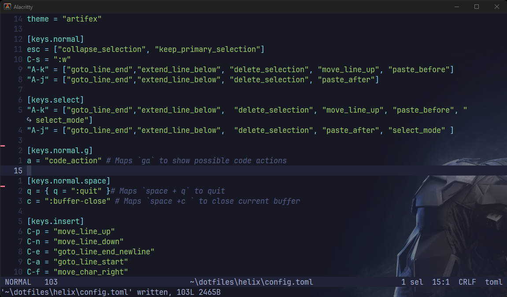
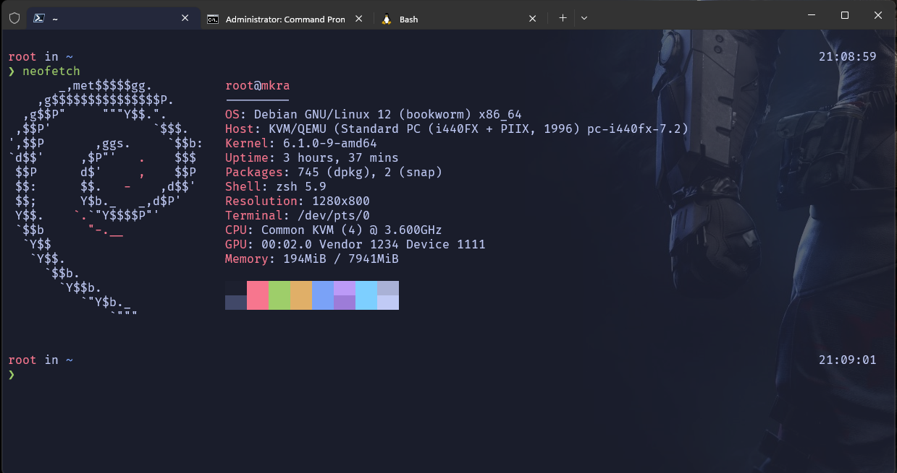
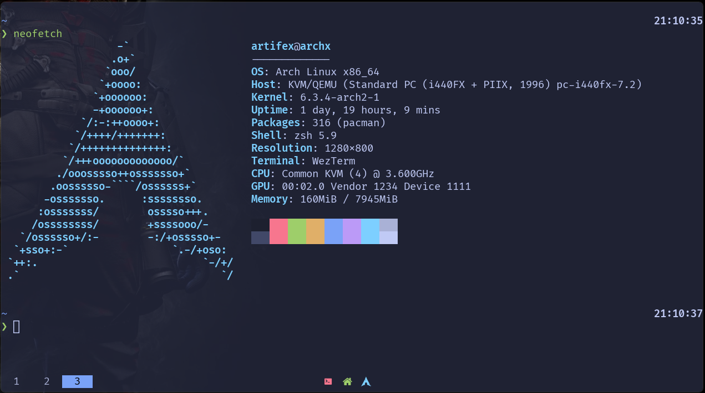
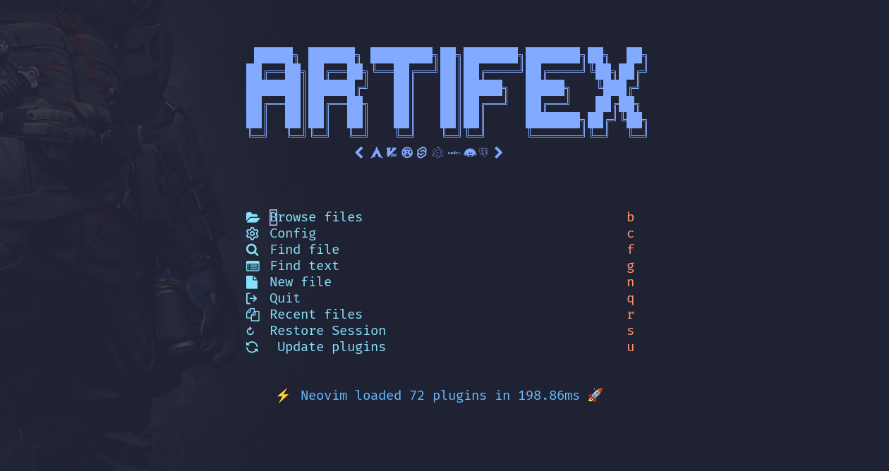

I don't hate VScode, i use it from time to time when my neovim
config breaks yes sometimes updates from plugins break it

Yes i use windows

## The choices in terminal emulator

### [Alacritty](https://alacritty.org/)

Alacritty is a modern terminal emulator that comes with sensible defaults, but allows for extensive configuration. By integrating with other applications, rather than reimplementing their functionality, it manages to provide a flexible set of features with high performance. The supported platforms currently consist of BSD, Linux, macOS and Windows.

> the aesthetics an be configured well, does not support multiplexing tabs and default keybindings are
> hard to bypass no ligature support for nerdfont and some symbols are missing, but blazingly fast,
> i'd prefer it if i am on linux and use my tmux for multiplexing windows and panes.

### [Windows Terminal](https://github.com/microsoft/terminal)

The Windows Terminal is a modern, fast, efficient, powerful, and productive terminal application for users of command-line
tools and shells like Command Prompt, PowerShell, and WSL. Its main features include multiple tabs, panes,
Unicode and UTF-8 character support, a GPU accelerated text rendering engine, and custom themes, styles, and
configurations.

> not bad microsoft, i use it when using powershell or testing out a new shell like nushell,
> keybindings are aesthetics can be configured. performance and rendering is superb but some
> nerdfont symbols or ligatures are missing

### [Wezterm](https://wezfurlong.org/wezterm/)

A GPU-accelerated cross-platform terminal emulator and multiplexer written by [@wez](https://github.com/wez)
and implemented in Rust

> This is what i use on my daily drive, my configuration are on my [dotfiles repo](https://github.com/directormac/dotfiles/blob/main/wezterm)
> the modules are on this [directory](https://github.com/directormac/dotfiles/tree/main/w3zterm),
> although installation in other linux distro is not noob friendly it works as an
> emulator, multiplexor and configurable via lua, you can hack it the way you want it.

### Cygwin, gitbash ++ the rest of them

> no customization at all, keybindings are important to a certain workflow.

---

## Editors

### [Helix](https://helix-editor.com/)

it welcomed me to a universe of terminal editors, although there is no support for plugins yet
the base and defaults are well thought of you might not even need plugins to be honest, my [config](https://github.com/directormac/dotfiles/blob/main/helix/config.toml)
is pretty basic, i use it in editing if i edit single files. i added emacs bindings like C-p, C-n, C-f, and more.

lsp's should be installed in the system intself, as for syntax highlighting most of the languages are supported

its BLAZINGLY FAST!!!! 🔥

### [Neovim](https://neovim.io/)

the alpha of editors?!!

With the right plugin manager you cant go wrong about it i use [LazyVim](https://lazyvim.org)
with its default configuration [folke](https://github.com/folke) guarantees he didn't miss a feature you'd like
best DX i have experienced so far. check out my config [here](https://github.com/directormac/dotfiles/tree/main/nvim)
only notable additions are scope.nvim and rust-tools

crashes sometimes on windows when some cmp's are loading and i type too fast into it.

---

## Dealing with dependencies

The main thing i use to manage my dependencies is [scoop](https://scoop.sh)

- Installation and Updates are eazypeazy

- No need to deal with environment paths, it handles all your shims

- From linux binaries like cmake and build tools for c++ bindings are available

- Relies on powershell, when i call on my bash shell in windows it popups another window of pwsh

- versioning is also supported!

my dependencies are automatically installed via a batch script check [here](https://github.com/directormac/dotfiles/blob/main/windows_auto.bat)
the list are there

my dotfiles synchonizes to my machines using [dotter](https://github.com/SuperCuber/dotter) thanks SuperCuber,
it is configurable whether i'm running it on unix based or windows machine

i will probably edit all the readme.md on my dotfiles repo so anyone can reproduce it.

that will be all for today, an extensive post on how i configured my wezterm and my general workflow will be added soon.
Have a good day!

---

Incase you did not notice my wallpaper , I am **batman**

