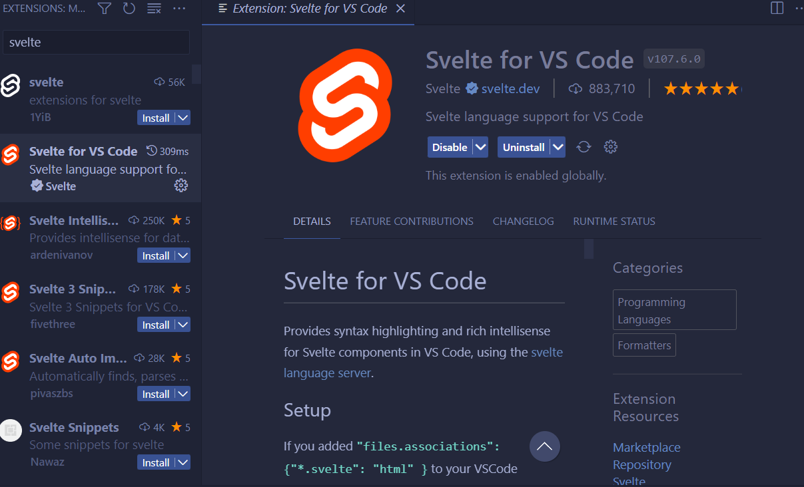
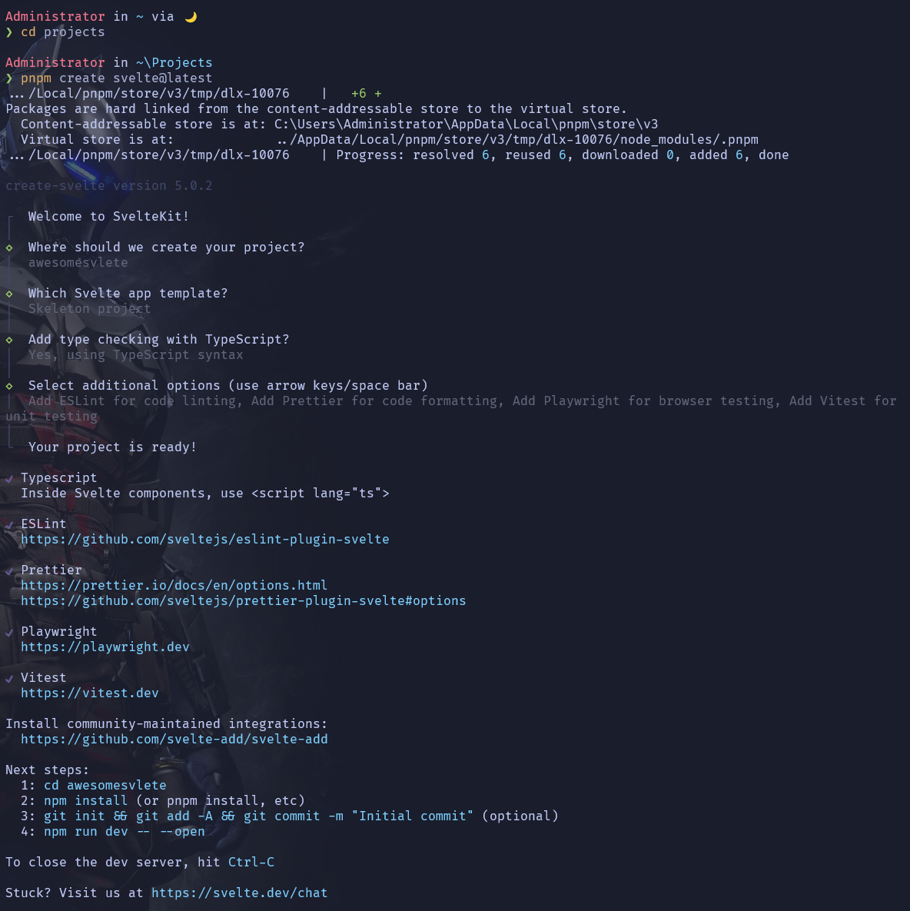
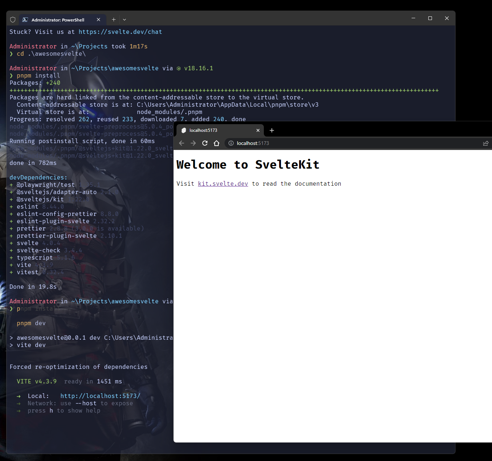

In commun usage, a scoop is any specialized spoon used to serve food.

In windows scoop is a command-line installer for Windows, you dont have to
click the next button and google your way in finding the installer of a common app.

A developer todays installs tons of dependencies to build something that meets
the users demand.

## Installation

Every windows 10 and 11 nowadays have the basic scoop requirements

1. Run powershell
2. Paste the following command

```sh
Set-ExecutionPolicy RemoteSigned -Scope CurrentUser # Optional: Needed to run a remote script the first time
irm get.scoop.sh | iex
```

if your account is an administrator please follow this [link](https://github.com/ScoopInstaller/Install#readme)

3. If anything goes well you can close your powershell window
4. Before proceeding please uninstall nodejs, windows terminal or vscode
   as scoop will not uninstall it for you
5. Scoop application lives in your home folder e.g `C:/Users/youraccount/scoop/`

## Apps to be installed for common JS Development

The provided links are their repositories, we are devs not animals
If you went through all the links you can read things about how to install them

- [Git](https://github.com/git/git) an open source distributer version control system
- [Windows Terminal](https://github.com/microsoft/terminal) a terminal with tabs
- [Vistual Studio Code](https://github.com/microsoft/vscode) a text editor
- [NVM(Node Version Manager)](https://github.com/nvm-sh/nvm) like scoop it manages node versions for you
- [Pwsh](https://github.com/PowerShell/PowerShell) A new version of powershell

Now run `cmd` or `powershell`

```sh
scoop bucket add extras
scoop install git nvm extras/windows-terminal extrax/vscode
```

After installation please use your new windows terminal

Installing nodejs with nvm

```sh
# I am using lts(Long Term Support) version
nvm install lts
# If you want the lastest cutting edge , gun in the foot nodejs use the command below
nvm install latest
```

If you need a specific version of nodejs follow this [link](https://github.com/nvm-sh/nvm/blob/master/README.md)

After installing node lets activate a certain version

```sh
# nvm use version for whatever version you installed
nvm use lts
# check installation
node -v
npm -v
```

If you are looking for the context menu where you open windows terminal or vscode on a certain folder
`install-context.reg` is provided for you at e.g for windows terminal
`C:\Users\yourname\scoop\apps\windows-terminal\current`
`C:\Users\yourname\scoop\apps\pwsh\current`
same goes for vscode just look at the current folder of a certain app

I personally use pnpm to handle my node packages on projects dont ask me why go [here](https://pnpm.io/)

```sh
scoop install pnpm
```

A `scoop update pnpm` wont work if pnpm installed a global package at this point pnpm manages
its own version

I also use a nerd-font called FiraCode

```sh
scoop bucket add nerd-fonts
scoop install nerd-fonts/FiraCode-NF
```

For more `Scoop` packages search [here](https://scoop.sh/#/apps) even winrar is there
but ffs use 7-zip it can also unrar a rar file.

---

## Visual Studio Code

Depending on the framework or library you are using there are some useful extensions you can use

Please refer to the official [docs](https://code.visualstudio.com/docs/editor/extension-marketplace)
on how to install extensions and tools for your convinience.

Personally i use the following

- [Tokyo Night Storm](https://marketplace.visualstudio.com/items?itemName=enkia.tokyo-night) as my theme
- [file-icons](https://marketplace.visualstudio.com/items?itemName=file-icons.file-icons)
- [Prettier](https://marketplace.visualstudio.com/items?itemName=esbenp.prettier-vscode)
- [ESLint](https://marketplace.visualstudio.com/items?itemName=dbaeumer.vscode-eslint)

Its a swarm of extensions so be aware of what you are installing

A quick note

- Only Install what you need
- Use an official extension for a framework or workflow you need

A good example is for svelte the officials ones have a ✔️



## Testing your environment

In this exercise we are gonna scaffold a SvelteKit project

1. Open your windows terminal the default directory where it hopens is where your home directory is
   `C:\Users\yourusername`
2. Create a Projets folder and go into into that directory

```sh
mkdir Projects # Creates a Project directory
cd Projects # Go in the Projects directory
```

3. Create a SvelteKit app

```sh
#if using npm replace pnpm with npm
pnpm create svelte@latest
```

Prompts use enter to select the option space for multi selection and arrow keys for navigation

- Where should we create your project? give a directory name where your project source code will be created at
- Which Svelte app template? Either a Skeleton Project for app development
- Add type checking with TypeScript? either use JS with doc comments or Typescript
- Some extra cool stuff to be added

<details><summary>An Image of the process</summary>



</details>

<details><summary> An Example proccess</summary>

```sh
Administrator in ~ via 🌙
❯ cd projects

Administrator in ~\Projects
❯ pnpm create svelte@latest
.../Local/pnpm/store/v3/tmp/dlx-10076    |   +6 +
Packages are hard linked from the content-addressable store to the virtual store.
  Content-addressable store is at: C:\Users\Administrator\AppData\Local\pnpm\store\v3
  Virtual store is at:             ../AppData/Local/pnpm/store/v3/tmp/dlx-10076/node_modules/.pnpm
.../Local/pnpm/store/v3/tmp/dlx-10076    | Progress: resolved 6, reused 6, downloaded 0, added 6, done

create-svelte version 5.0.2

┌  Welcome to SvelteKit!
│
◇  Where should we create your project?
│  awesomesvelte
│
◇  Which Svelte app template?
│  Skeleton project
│
◇  Add type checking with TypeScript?
│  Yes, using TypeScript syntax
│
◇  Select additional options (use arrow keys/space bar)
│  Add ESLint for code linting, Add Prettier for code formatting, Add Playwright for browser testing, Add Vitest for
unit testing
│
└  Your project is ready!

✔ Typescript
  Inside Svelte components, use <script lang="ts">

✔ ESLint
  https://github.com/sveltejs/eslint-plugin-svelte

✔ Prettier
  https://prettier.io/docs/en/options.html
  https://github.com/sveltejs/prettier-plugin-svelte#options

✔ Playwright
  https://playwright.dev

✔ Vitest
  https://vitest.dev

Install community-maintained integrations:
  https://github.com/svelte-add/svelte-add

Next steps:
  1: cd awesomesvlete
  2: npm install (or pnpm install, etc)
  3: git init && git add -A && git commit -m "Initial commit" (optional)
  4: npm run dev -- --open

To close the dev server, hit Ctrl-C

Stuck? Visit us at https://svelte.dev/chat

```

</details>

4. Go isnside the directory svelte just created for us e.g `awesomesvelte` or whatever
   the project name you chose

```sh
cd awesomesvelte
```

5. Install dependencies

```sh
# or npm install
pnpm install
```

6. Open it in Visual Studio code

```sh
code .
```

7. Run in VSCode terminal or your windows terminal

```sh
# or npm run dev
pnpm dev
```

If all went well you can open your browser and head to `http://localhost:5173`



Awesome! Goodluck, the goal of this post is to improve our developer experience.

