## The Stack

- ### [SvelteKit](https://kit.svelte.dev)
  >
  > SvelteKit serves as our chosen frontend framework or "BFF" (Backend For Frontend). This powerful framework facilitates seamless development of efficient and interactive user interfaces. Leveraging its component-based architecture, SvelteKit allows us to create dynamic web applications with minimal boilerplate code.
  >
- ### [Pocketbase](https://pocketbase.io/) at [PocketHost](https://pockethost.io)
  >
  > Pocketbase plays a crucial role as a single, compact binary file serving as our "BaaS" (Backend as a Service) for the BFF. This innovative solution simplifies backend operations by providing essential functionalities without the need for extensive infrastructure setup. With Pocketbase, we can efficiently manage databases, authentication, and other backend services, allowing us to focus more on building engaging user experiences.
  >
- ### [Vercel](https://vercel.com)
  >
  > Vercel stands out as our preferred platform for deploying our landing page. Its zero-config requirement for SvelteKit web apps streamlines the deployment process, allowing us to effortlessly showcase our application to the world. Additionally, Vercel's reliability and scalability make it an excellent choice for hosting our landing page. While Vercel handles the production environment, we also implement a redundant deployment strategy by hosting a version on our homelab, ensuring flexibility and control over our deployment infrastructure.

## SvelteKit Dependencies & Configuration

### [Skeleton](https://www.skeleton.dev/)

Our main UI Toolkit, allows us to create accessible interface, with it comes one of its dependency which is [floating-ui/dom](https://floating-ui.com/docs/tutorial) and [tailwindcss](https://tailwindcss.com/). _floating-ui/dom_ is only required if you need the [Popup](https://www.skeleton.dev/utilities/popups) elements, given that tailwind is required by skeleton components extends _tailwindscss_ utility-first classes.

Installation steps are as follows after creating a fresh _sveltekit_ project, you just need to install skeleton , tailwind and floating-ui/dom with the following commands

```bash
#Installing Skeleton
npm install -D @skeletonlabs/skeleton @skeletonlabs/tw-plugin #Required
npm install @floating-ui/dom #Not required if not using any of popup
```

```bash
# Installing tailwind and utilities with svelte-add
npx svelte-add@latest tailwindcss --tailwindcss-forms --tailwindcss-typography
npm install
```

> [svelte-add](https://github.com/svelte-add/svelte-add) is a handy tool to add more integrations in a svelte or sveltekit project, also supports bootstrap, bulma,mdsvex, imagetools and more! check them out too!

after installing all of that skeleton requires you to modify the tailwind configuration which is located at the root of your project `tailwind.config.[ts|js|cjs]` we used _typescript_ in our project so we use the `.ts` file extension here is what our configuration looked like!

<details><summary class="text-xl">tailwind.config.ts(click me for code preview)</summary>

```typescript
import { join } from 'path' // Required when using typescript, as we used join blow
import type { Config } from 'tailwindcss'
import forms from '@tailwindcss/forms'
import typography from '@tailwindcss/typography'
//Skeleton Specific imports
import { skeleton } from '@skeletonlabs/tw-plugin'
import { daedalus } from './src/themes'

const config = {
 // Dark mode handled via the class method
 darkMode: 'class',
 content: [
  //Tailwind defaults
  './src/**/*.{html,js,svelte,ts}',
  // Skeleton needs to append this because their components rely on utility classes
  join(require.resolve('@skeletonlabs/skeleton'), '../**/*.{html,js,svelte,ts}')
 ],
 theme: {
  extend: {}
 },
 plugins: [
  forms,
  typography,
  skeleton({
   themes: {
    // Our generated theme that aligns with skeleton's design token
    custom: [daedalus]
   }
  })
 ]
} satisfies Config

export default config
```

</details>

The generated theme source code can be [viewed here](https://github.com/daedalus-developers/daedalus.codes/blob/main/src/themes.ts), generated our [theme here](https://www.skeleton.dev/docs/generator).

To enhance our developer experience, we introduced additional dependencies, including:

- As recommended by Skeleton, learn more about its [usage here](https://www.skeleton.dev/docs/purgecss).

- [tailwind-merge](https://www.npmjs.com/package/tailwind-merge) and [clsx](https://www.npmjs.com/package/clsx):

```typescript
import { type ClassValue, clsx } from 'clsx'
import { twMerge } from 'tailwind-merge'

export const sx = (...inputs: ClassValue[]) => twMerge(clsx(inputs))
```

Now, you can employ the sx function in your Svelte files like this:

`class={sx('input-bordered input w-full', errors ? 'input-error' : '')}`

Check out the actual [implementation here](https://github.com/daedalus-developers/daedalus.codes/blob/main/src/lib/components/forms/password-input.svelte)

These two proved invaluable for dynamically injecting classes into our components based on a given state. This implementation provides a convenient and efficient way to manage dynamic class injections, improving the flexibility and maintainability of our codebase.

- [prettier-plugin-tailwindcss](https://github.com/tailwindlabs/prettier-plugin-tailwindcss) this sorts our tailwind classes, since we are using prettier by default why not extend it by sorting the classes too!

We've incorporated Skeleton's layouting component, `[<AppShell />](https://www.skeleton.dev/components/app-shell)` into our design. This integration necessitated updates to both `app.html` and `app.postcss` . The final output for these files now resembles the following, Feel free to explore the provided link for a deeper understanding of the features and capabilities offered by Skeleton's AppShell component.

`app.html`

```html
<!doctype html>
<html lang="en" class="dark">
 <head>
  <meta charset="utf-8" />
  <link rel="icon" href="%sveltekit.assets%/favicon.ico" />
  <meta name="viewport" content="width=device-width, initial-scale=1" />
  %sveltekit.head%
 </head>
 <body data-sveltekit-preload-data="hover" data-theme="daedalus">
  <div style="display: contents" class="h-full overflow-hidden">%sveltekit.body%</div>
 </body>
</html>
```

`app.postcss`

```css
/* Write your global styles here, in PostCSS syntax */
@tailwind base;
@tailwind components;
@tailwind utilities;
@tailwind variants;

html,
body {
 /* Installed via fontsource */
 font-family: 'Inter Variable', sans-serif;
 @apply h-full overflow-hidden;
}
```

Expanding on our root layout, we've introduced some significant enhancements. In this updated layout, we incorporate the _[Inter](https://fontsource.org/fonts/inter)_ font and `app.postcss` Furthermore, we initialize the _@floating-ui/dom_ utilities using stores provided by skeleton. Additionally, we initiate the use of _[sveltekit-view-transition](https://github.com/paoloricciuti/sveltekit-view-transition)_ by [@paoloricciuti](https://github.com/paoloricciuti).

The inclusion of Skeleton adds a layer of utility components and global stores that we initialize at this stage, making them accessible across our various components and pages. Noteworthy additions include:

- [Drawers](https://www.skeleton.dev/utilities/drawers)
- [Modals](https://www.skeleton.dev/utilities/modals)
- [Toasts](https://www.skeleton.dev/utilities/toasts)

For detailed information on these utilities, refer to the Skeleton documentation. This refined root layout sets the stage for a more sophisticated and feature-rich user interface throughout our application.

<details><summary class="text-xl">+layout.svelte(click me for code preview)</summary>

```svelte
<script lang="ts">
 import '@fontsource-variable/inter';
 import '../app.postcss';
 import { computePosition, autoUpdate, flip, shift, offset, arrow } from '@floating-ui/dom';
 import { Modal, Toast, storePopup } from '@skeletonlabs/skeleton';
 import { initializeStores } from '@skeletonlabs/skeleton';
 import { setupViewTransition } from 'sveltekit-view-transition';
 import { ModalRegistry, Drawers } from '@components';
 import { onNavigate } from '$app/navigation';

 storePopup.set({ computePosition, autoUpdate, flip, shift, offset, arrow });
 initializeStores();
 setupViewTransition();

 // Use onNavigate instead of afterNavigate so it will work on url fragment identifier eg #about
 onNavigate(() => {
  let elemPage: HTMLElement | null = document.querySelector('#page');
  elemPage!.scrollTop = 0;
 });
</script>

<Drawers />
<Modal components={ModalRegistry} />
<Toast position="br" />
<slot />
```

</details>

We've implemented [group](https://kit.svelte.dev/docs/advanced-routing#advanced-layouts), a remarkable feature that empowers us to break free from a uniform layout structure. This allows us to employ distinct layouts for specific pages throughout our application, providing a versatile and tailored user experience.

### [Sveltekit Superforms](https://superforms.rocks/) & [Zod](https://zod.dev/)

Always prioritize security by validating user inputs and never solely rely on client-side data. This crucial practice is exemplified through the use of two powerful tools: sveltekit-superforms created by _sveltekit-superforms_ created by [ciscoheat](https://github.com/ciscoheat) and _zod_ created by [collinhacks](https://github.com/colinhacks). These libraries work in tandem to reinforce the integrity of user input, ensuring a robust and reliable validation process.

Zod Usage

<details> <summary class="text-xl">user.types.ts.svelte(click me for code preview)</summary>

```ts
export const requiredString = (
 name: string,
 constraint?: {
  min?: number
  max?: number
 }
) => {
 if (constraint?.min && constraint?.max) {
  return string({
   required_error: `${name} is required.`
  })
   .min(constraint.min, `${name} must contain atleast ${constraint.min} characters.`)
   .max(constraint.max, `${name} must contain atleast ${constraint.max} characters.`)
 } else if (constraint?.min) {
  return string({
   required_error: `${name} is required.`
  }).min(constraint.min, `${name} must contain atleast ${constraint.min} characters.`)
 } else if (constraint?.max) {
  return string({
   required_error: `${name} is required.`
  }).max(constraint.max, `${name} must contain atleast ${constraint.max} characters.`)
 } else {
  return string({ required_error: `${name} is required.` })
 }
}

export const userRole = zEnum(['admin', 'team', 'user'])

export type UserRole = zInfer<typeof userRole>

export const usernameSchema = requiredString('Username', { min: 3, max: 16 })
 .trim()
 .toLowerCase()
 .regex(/^[a-zA-Z0-9_]+$/)

// Actual schema at pocketbase
export const userSchema = object({
 id: string(),
 username: usernameSchema,
 firstName: requiredString('First Name', {
  min: 3,
  max: 32
 }),
 lastName: requiredString('Last Name', { min: 3, max: 32 }),
 avatar: string(),
 email: string({
  required_error: 'Email address is required'
 }).email('Invalid email address'),
 verified: boolean(),
 role: userRole.default('user'),
 created: string().datetime(),
 updated: string().datetime()
})

// this is for superforms create and update
export const userFormSchema = userSchema
 .omit({
  created: true,
  updated: true
 })
 .extend({
  id: userSchema.shape.id.optional(),
  role: userSchema.shape.role.optional(),
  verified: userSchema.shape.verified.optional(),
  avatar: userSchema.shape.avatar.optional()
 })
```

</details>

[source code here](https://github.com/daedalus-developers/daedalus.codes/blob/main/src/lib/types/user.types.ts)

Zod stands out due to its versatility and adaptability. For instance, in working with the requiredString type, I found that I could leverage Zod's built-in methods to generate accurate error messages based on the specified field name. This capability proves particularly useful in scenarios involving fields such as firstName and lastName. Additionally, I extended this functionality to the username field by incorporating actions like trimming, converting to lowercase, and implementing a regex pattern to ensure field validity. It's a niche feature that enhances the overall flexibility and customization provided by Zod.

[auth.type.ts](https://github.com/daedalus-developers/daedalus.codes/blob/main/src/lib/types/auth.types.ts)
[login-form.svelte](https://github.com/daedalus-developers/daedalus.codes/blob/main/src/lib/components/forms/login-form.svelte)

<details> <summary class="text-xl">login-form.svelte(click me for code preview)</summary>

```svelte
<script lang="ts">
 import { page } from '$app/stores';
 import { loginSchema } from '@types';
 import { superForm } from 'sveltekit-superforms/client';
 import TextInput from './text-input.svelte';
 import PasswordInput from './password-input.svelte';
 import { getToastStore } from '@skeletonlabs/skeleton';
 import { ASSET_URL } from '@utils';
 // import Icon from '@iconify/svelte';
 const toast = getToastStore();
 const { form, errors, constraints, enhance, message } = superForm($page.data.form, {
  validators: loginSchema,
  onResult: async ({ result }) => {
   if (result.type === 'redirect')
    toast.trigger({
     message: 'Login successful'
    });
  },
  applyAction: true,
  invalidateAll: true
 });
</script>

<div class="flex flex-col gap-4">
 <div class="mx-auto py-4">
  
  <h1 class="h2">Login</h1>
 </div>
 <div class="form-control mx-auto min-w-[50%] text-center">
  {#if $message}
   <div class="variant-ghost-error p-4">{$message}</div>
  {/if}
 </div>
 <form
  method="POST"
  action="/api/actions/auth?/legacy"
  class="form mx-auto min-w-[50%]"
  use:enhance
 >
  <TextInput
   name="key"
   label="Username or Email"
   placeholder="e.g johnwick"
   bind:value={$form.key}
   errors={$errors.key}
   constraints={$constraints.key}
  />
  <PasswordInput
   name="password"
   label="Password"
   placeholder="Password"
   bind:value={$form.password}
   errors={$errors.password}
   constraints={$constraints.password}
  />
  <button class="variant-filled-primary btn my-4 w-full">Login</button>
 </form>
 <p class="text-center">
  No account yet? Register <a class="underline" href="/register">here</a>.
 </p>
</div>
```

</details>

[+page.server.ts](https://github.com/daedalus-developers/daedalus.codes/blob/main/src/routes/api/actions/auth/%2Bpage.server.ts)

<details> <summary class="text-xl">+page.server.ts(click me for code preview)</summary>
  
```ts
export const actions: Actions = {
legacy: async ({ request, locals }) => {
   // Sperforms using the zod schema we wrote at auth.types.ts
  const form = await superValidate(request, loginSchema);
    // This returns field errors, values and an additional message
  if (!form.valid) return message(form, 'Please fill in all required fields');
    // extract the information from the form
  const { key, password } = form.data;
  
  try {
   // Authenticate the user
   await locals.DB.collection(Collections.Users).authWithPassword(key, password);
  } catch (error) {
   // if something goes wrong we can return an error message depending on the response from our pocketbase api
   const err = error as ClientResponseError;
   return err.response.code !== 400
    ? message(form, INVALID_CREDENTIALS)
    : message(form, SOMETHING_WENT_WRONG, {
      status: err.response.code
     });
  }
   // Redirect the user if successful
  if (locals.DB.authStore.isValid && locals.DB.authStore.model) {
   locals.user = locals.DB.authStore.model;
   redirect(302, '/me');
  }
    // This is safeguard for superforms always return the form, incase all of the above conditions aren't met
  // this one is returned.
  return message(form, `Bad Request`);
 },
};
```

</details>

### [Carta](https://github.com/BearToCode/carta)

Carta is a new lightweight, fast and extensible markdown editor created by [BearToCode](https://github.com/BearToCode), works like a charm in SvelteKit bonus is that it supports Server Side Rendering(more on this later) check out more of their [examples here](https://beartocode.github.io/carta/examples)

We used most of the available plugins of carta available e.g _Attachment_, _Code_, _emoji_ and _slash_. where most of them are useful in editing our profile page.

### In action with plugins

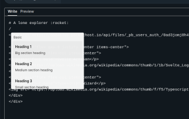

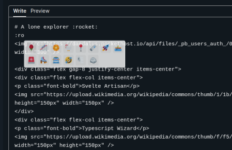

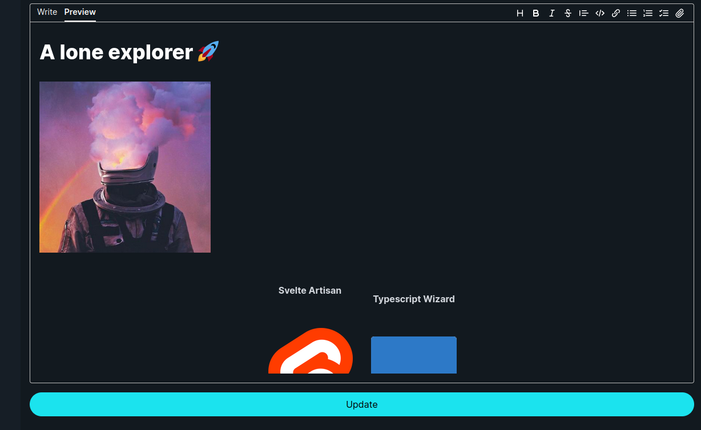

Carta plugins specially the [attachment](https://beartocode.github.io/carta/plugins/attachment) part works well with our _pocketbase_ api, where it needs an endpoint that returns a url for the uploaded attachment.

_[+server.ts](https://github.com/daedalus-developers/daedalus.codes/blob/main/src/routes/api/actions/attachments/%2Bserver.ts)_

<details><summary class="text-xl">+server.ts(click me for code preview)</summary>

```ts
import { error, json } from '@sveltejs/kit'
import type { RequestHandler } from './$types'
import { db } from '@server'
import { Collections } from '@types'
import type { ClientResponseError } from 'pocketbase'

// Post endpoint at "/api/attachtmenths"
export const POST: RequestHandler = async ({ request, locals }) => {
 const formData = await request.formData()
 const file = formData.get('file')
 // validate if file from form data is instance of a file
 // and check if user is authenticated to do the request
 if (file instanceof File && locals.user) {
  try {
   // Upload the attachment
   const upload = await db.collection(Collections.Media).create({
    file
   })
   // return a json with url
   return json({ url: db.files.getUrl(upload, upload.file) })
  } catch (e) {
   // Return the actual error from pocketbase
   const err = e as ClientResponseError
   error(400, { message: err.message })
  }
 }
 // just a safeguard
 error(400, { message: 'No file provided' })
}
```

</details>

_[userdetails-form.svelte](https://github.com/daedalus-developers/daedalus.codes/blob/main/src/lib/components/forms/userdetails-form.svelte)_

<details><summary class="text-xl">userdetails-form.svelte(click me for code preview)</summary>

```ts
const carta = new Carta({
 sanitizer: purifier.sanitize,
 extensions: [
  attachment({
   async upload(file) {
    const formData = new FormData()
    formData.append('file', file)
    const response = await fetch('/api/actions/attachments', {
     method: 'POST',
     body: formData
    })
     .then((res) => res.json())
     .then((res) => res.url as string)
    return response
   }
  }),
  emoji(),
  slash(),
  code()
 ]
})
```

</details>

A [featured profile](https://www.daedalus.codes/andite) can be previewed at the given link, a co member of the community straightly copied his [README.md at github](https://github.com/Raearn) although its not perfectly aligned(we will fix it in future revisions) you have to admire how simple it is implemented on sveltekit and carta. code snippets are located at the pocketbase section.

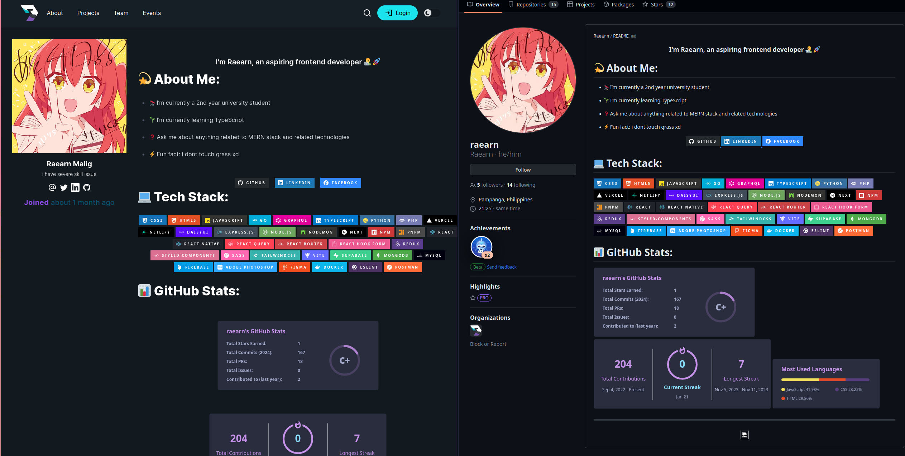

## Pocketbase

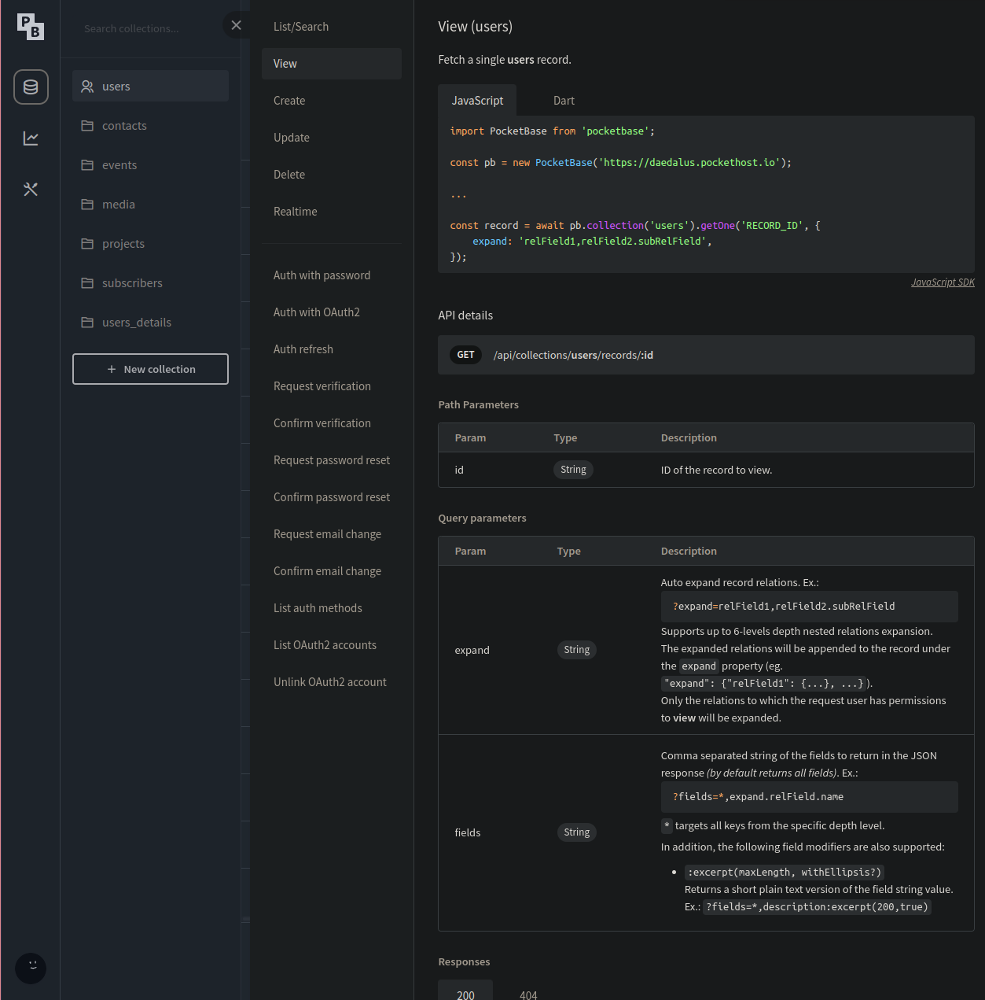

SvelteKit seamlessly integrates with various APIs, but when it comes to a unique solution, Pocketbase stands out. What sets Pocketbase apart is its distinctive blend of a Svelte-built admin UI, backed by Go. This choice was deliberate, driven by the rich features it brings to our stack, including:

- Realtime Database: embedded sqlite with realtime subscriptions through sdk and rest api.
- Authentication: wether its a classic email/username login or oauth2 integrations without worry.
- File Storage: store files within the filesystem or to an s3 compatible storage.
  Explore these features in detail by referring to the [PocketBase documentation](https://pocketbase.io/docs),

Upon initial inspection, one might question the readiness of [pocketbase](https://github.com/pocketbase/pocketbase) created by [@ganigeorgiev](https://github.com/ganigeorgiev) for production use, it is not! he created it intentionally for his other project [presentator](https://github.com/presentator/presentator) a design presentation and collaboration platform. One noteworthy aspect is that Pocketbase, designed intentionally as a single binary with SQLite embedded underneath, allows us to opt for breaking changes that align with the version of the SDK we use. Presently, we are utilizing v.20.0, deployed at [pockethost](https://pockethost.io) an [open source project](https://github.com/pockethost/pockethost) created by [@benallfree](https://github.com/benallfree). Pockethost serves as a cloud hosting platform tailored for Pocketbase, contributing to the robustness and scalability of our chosen stack.

We also hooked our pocketbase file storage to [Cloudflare R2](https://www.cloudflare.com/developer-platform/r2/) a global object storage by cloudflare with 10gb free storage! all our media files are stored there even the ones that come from carta attachment plugin.

### Data Fetching from pocketbase

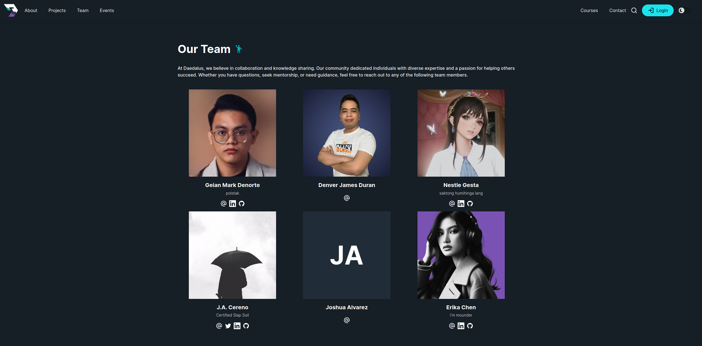

Incorporating the [Pocketbase JavaScript SDK](https://github.com/pocketbase/js-sdk), we initiated a global server only instance using the following setup:
[Check out the source code here](https://github.com/daedalus-developers/daedalus.codes/blob/main/src/lib/server/index.ts)

```typescript
import { env as publicEnv } from '$env/dynamic/public'
import { env } from '$env/dynamic/private'
import PocketBase from 'pocketbase'

// Initialize a Pocketbase client with authentication
export const createClient = async () => {
 const pocketbase = new PocketBase(publicEnv.PUBLIC_PB_URL)
 try {
  // Authenticate as admin using provided credentials
  await pocketbase.admins.authWithPassword(env.PB_ADMIN_EMAIL!, env.PB_ADMIN_PASSWORD!)
 } catch (e) {
  console.log(e)
 }
 return pocketbase
}

// Create a global instance of the Pocketbase client
export const db = await createClient()
// Disable auto-cancellation to prevent unintended termination of operations
db.autoCancellation(false)
```

This module, strategically placed as a [Server-only module](https://kit.svelte.dev/docs/server-only-modules) ensures that sensitive information such as credentials is not bundled with the client-side code. This is a security measure provided by SvelteKit, allowing us to safeguard our secrets and maintain a secure development environment.

Usage of the global instance, we can use the pocketbase instance directly on our server side code but we went away and further abstracted the queries

```typescript
import { db } from '@server'

import type { RecordModel } from 'pocketbase'

enum Collections {
 Users = 'users',
 UsersDetails = 'users_details'
}

// Query user by id
export const queryUser = (userId: string) =>
 db
  .collection(Collections.Users)
  .getOne(userId)
  .then((data) => {
   // pocketbase by default returns the fileID, we need to get its actual URL so we can use this directly
   // in an  tag
   data.avatar = db.files.getUrl(data, data.avatar)
   return data
  })
  .catch(() => {
   return undefined
  })
// Querying by fields with typesafety
export const queryUserByUsername = async (username: string): Promise<RecordModel | undefined> => {
 // Safeguard query we ensure that the user exists
 const query = await db
  .collection(Collections.Users)
  // the sdk provides us with a `db.filter` with the following syntax
  .getFirstListItem(db.filter('username = {:username}', { username }))
  .catch(() => undefined)
 if (!query) return undefined
 // Querying the actual User Details
 return db
  .collection(Collections.UsersDetails)
  .getFirstListItem(db.filter('user= {:id}', { id: query.id }), {
   expand: 'user'
  })
  .then((data) => {
   if (data.expand?.user?.avatar)
    // Same as above as the avatar file is stored on the original User table used for only for authentication and identification,
    // we also added a parameter in our query to get only the thumbnail of the file
    data.expand.user.avatar = db.files.getUrl(data.expand.user, data.expand.user.avatar, {
     thumb: '300x350'
    })
   return data
  })
  .catch(() => undefined)
}
```

[+page.server.ts](<https://github.com/daedalus-developers/daedalus.codes/blob/main/src/routes/(profile)/%5Busername%5D/%2Bpage.server.ts>)

`src/routes/(profile)/[username]/+page.server.ts`

```typescript
import { error } from '@sveltejs/kit'
import type { PageServerLoad } from './$types'
import { queryUserByUsername } from '@server/queries'

export const load: PageServerLoad = async ({ params }) => {
 // Extract the username from url [username]
 const { username } = params
 if (username === 'admin') error(404, `Not found`)
 // Query user from pocketbase
 const query = await queryUserByUsername(username)
 // Return an error page if user with given username does not exist
 if (!query) error(404, `Not found`)
 // Return the object
 return {
  query
 }
}
```

Rendering the data

[source code here +page.svelte](<https://github.com/daedalus-developers/daedalus.codes/blob/main/src/routes/(profile)/%5Busername%5D/%2Bpage.svelte>)

Using Carta as renderer

```svelte

<script lang="ts">
 import { UserCard } from '@components';
 import type { PageData } from './$types';
 import { CartaViewer, Carta } from 'carta-md';
 import { formatDistance } from 'date-fns';
 import { code } from '@cartamd/plugin-code';
 import { emoji } from '@cartamd/plugin-emoji';
 import { ASSET_URL } from '@utils';

 // Get data from page load this can be PageServerData or PageData
 export let data: PageData;

 // Destructure the query returned from page load and rename it as user
 const { query: user } = data;

   //Initializing carta on this page with the plugins we need
 const carta = new Carta({
  extensions: [code(), emoji()]
 });

</script>

<svelte:head>
 <title>{`Daedalus - ` + user.expand?.user.username}</title>
 <meta property="og:type" content="article" />
 <meta property="og:title" content={user.expand?.user.username} />
 <meta property="og:description" content={user.bio} />
 <meta
  property="og:image"
  content={user.expand?.user.avatar ? user.expand.user.avatar : ASSET_URL + 'daedalus.png'}
 />
</svelte:head>

<div class="m-8 flex h-screen w-screen">
 <div class="basis-1/4">
  <UserCard {user} />
  <p class="py-4 text-center text-xl">
   <span class="font-bold tracking-wide text-secondary-500"> Joined </span>
   <span class="font-medium text-tertiary-900">
    {formatDistance(new Date(user.created), new Date(), {
     addSuffix: true
    })}
   </span>
  </p>
 </div>
 <div class="basis-3/4">
  <CartaViewer {carta} value={user.details} />
 </div>
</div>
```

### Streamed Data

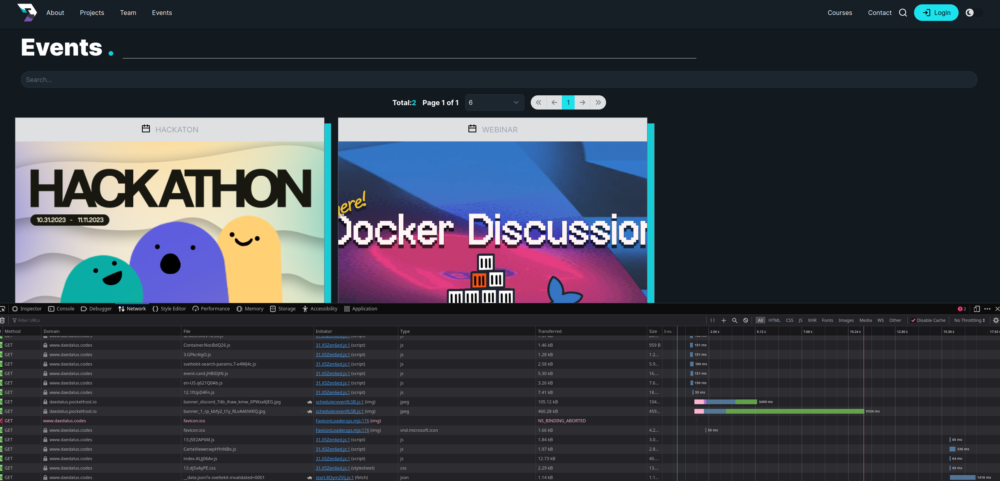

An example of how we utilize pocketbase sdk and sveltekit's capability an [example here](https://www.daedalus.codes/events).

[Pocketbase Filters and API Rules](https://pocketbase.io/docs/api-rules-and-filters/)

[Streaming with promises](https://kit.svelte.dev/docs/load#streaming-with-promises)

```typescript
export type eventFilter = {
 query?: string
 sort?: string
}

export const queryEvents = (
 // set defaults for parameters
 page: number = 1,
 perPage: number = 10,
 filter: eventFilter = {
  query: '',
  sort: 'created'
 }
) =>
 db
  .collection(Collections.Events)
  .getList(page, perPage, {
   //
   sort: '-date',
   // Not needed as we already disabled autocancellation
   requestKey: 'events',
   filter: db.filter(
    '(title ?~ {:title} || description ?~ {:description} || details ?~ {:details})',
    { title: filter.query, description: filter.query, details: filter.query }
   )
  })
  .then((collection) => {
   const events = collection.items.map((event) => {
    // Replace the preview property with actual file url!
    event.preview = db.files.getUrl(event, event.preview)
    return event
   })
   collection.items = events
   return collection
  })
```

`src/routes/(default)/events/+page.server.ts`

```typescript
import type { PageServerLoad } from './$types'
import { queryEvents } from '@server/queries'

export const load: PageServerLoad = ({ url }) => {
 // extract search params with key "q" or default with ""
 const query = url.searchParams.get('q') ?? ''
 // appends the page and perpage query provided by the EventPaginator Component
 const page = Number(url.searchParams.get('page')) + 1 || 1
 const perPage = Number(url.searchParams.get('perPage')) || 6

 return {
  // Return events as streamed promise
  events: queryEvents(page, perPage, {
   query
  })
 }
}
```

`src/routes/(default)/events/+page.svelte`

[event-paginator.svelte](<https://github.com/daedalus-developers/daedalus.codes/blob/main/src/routes/(default)/events/event-paginator.svelte>)

```svelte
<script lang="ts">
 import { ASSET_URL } from '@utils';
 import type { PageData } from './$types';
 import EventPaginator from './event-paginator.svelte';
 import { EventCard } from '@components';
 export let data: PageData;
</script>

<EventPaginator />

{#await data.events}
 Loading..
{:then events}
 <div class="grid grid-cols-1 gap-8 pt-4 md:grid-cols-3">
  {#each events.items as event}
   <EventCard {event} />
  {/each}
 </div>
{:catch}
 No events
{/await}
```

Svelte includes a logic block [#await](https://svelte.dev/docs/logic-blocks#await), allowing us to branch on Promise states, pending, fulfilled or rejected. this is comparable to jsx's(react, solidjs) or vue(experimental) `<Suspense />` component.

Most of the code implementation is at `EventPaginator` component where the input on the search is debounced and appended on the url as query parameters, it searches for the events collection for keywords of the desired event , given that the keywords exist on events.

### Data Submission

In the sections aboved, i have written about us utilizing zod binded in our forms and data types from pocketbase to forms, in all of our forms we used the best feature i think that svelte has to offer which is [Form Actions](https://kit.svelte.dev/docs/form-actions),

`src/routes/api/actions/users/+page.server.ts` api endpoint and the [userdetails-form.svelte](https://github.com/daedalus-developers/daedalus.codes/blob/main/src/lib/components/forms/userdetails-form.svelte),
[+page.server.ts](https://github.com/daedalus-developers/daedalus.codes/blob/main/src/routes/me/details/%2Bpage.server.ts) where we load the data to the page.

```ts
export const actions: Actions = {
 details: async ({ request, locals }) => {
  // Validate form using zod schema
  const form = await superValidate(request, userDetailsFormSchema)
  // return the form data submitted with errors if invalid
  if (!form.valid) return fail(400, { form })

  try {
   // Check if user is authenticated
   if (locals.user) {
    // extract user id
    const { id } = locals.user
    // Update data base on the fields
    const details = await db
     .collection(Collections.UsersDetails)
     .getFirstListItem(`user="${id}"`)
    await locals.DB.collection(Collections.UsersDetails).update(details.id, {
     bio: form.data.bio || '',
     details: form.data.details || '',
     x: form.data.x || '',
     linkedin: form.data.linkedin || '',
     github: form.data.github || '',
     user: id,
     updated: new Date()
    })
   }
   // as per superforms always return the form data!
   return { form }
  } catch (error) {
   // Cast error as ClientResponseError from pocketbase SDK
   const err = error as ClientResponseError
   // as per superforms always return the form data but now with a custom message
   return err.response.code !== 400
    ? message(form, INVALID_CREDENTIALS)
    : message(form, err.message, {
      status: err.response.code
     })
  }
 }
}
```

The `superform/client` module allows us to provide the form data and bind the value using the `bind:value` directive from svelte, including the erros and constraints defined in the schema we wrote using zod.

```svelte
<script lanmg="ts">
 import { userDetailsFormSchema } from '@types';
 import { superForm } from 'sveltekit-superforms/client';

 const { form, errors, constraints, enhance, message, delayed, tainted } = superForm(
  $page.data.form,
  {
   validators: userDetailsFormSchema,
   onResult: async ({ result }) => {
    if (result.type === 'success')
     toast.trigger({
      message: 'Profile updated.'
     });
   }
  }
 );
</script>
<form
  method="POST"
  action="/api/actions/users?/details"
  class="form mx-auto min-w-[50%]"
  use:enhance
 >
<TextInput
   name="bio"
   label="bio"
   placeholder="low born noob"
   bind:value={$form.bio}
   errors={$errors.bio}
   constraints={$constraints.bio}
  />
.... more snippet here
  <button class="variant-filled-primary btn my-4 w-full" disabled={$delayed || !$tainted}
   >Update</button
  >
</form>
```

We can also write the endpoint in the same `+page.server.ts` on the same route but we prefer to declare all our action endpoints at the `/api/actions` route, `form-action` api requires `method="POST"` if you use `method="post"` it will not work. `use:enhance` is the key to making the form actions work smoothly, hydrating the data based on the page load and returned data from the action endpoint.

### Authentication

[Pocketbase Authentication](https://pocketbase.io/docs/authentication/) uses JWT, by default admin requests can access its entire API, that is why our global instance is used as `server-only-module`, with [sveltekit server hooks](https://kit.svelte.dev/docs/hooks#server-hooks) think of it like a middleware or an interceptor, in this case it intercepts all the requests as we have not filtered on a per route basis.

[src/hooks.server.ts](https://github.com/daedalus-developers/daedalus.codes/blob/main/src/hooks.server.ts) and [src/app.d.ts](https://github.com/daedalus-developers/daedalus.codes/blob/main/src/app.d.ts)

```typescript
import type { Handle } from '@sveltejs/kit'
import PocketBase from 'pocketbase'
import { env } from '$env/dynamic/public'
import { Collections } from '@types'

export const handle: Handle = async ({ event, resolve }) => {
 // Initialize a client side pocketbase instance
 const USER_DB = new PocketBase(env.PUBLIC_PB_URL)
 // assign it to locals
 event.locals.DB = USER_DB

 // Check for cookie on if it exists on requests
 event.locals.DB.authStore.loadFromCookie(event.request.headers.get('cookie') || '')

 try {
  // Refresh the cookie if it is valid
  event.locals.DB.authStore.isValid &&
   (await event.locals.DB.collection(Collections.Users).authRefresh())
  // Assign the details to locals.user
  event.locals.user = { ...event.locals.DB.authStore.model }
 } catch (error) {
  event.locals.DB.authStore.clear()
 }
 // Resolve the request
 const response = await resolve(event)
 // set the coookie
 response.headers.set('set-cookie', event.locals.DB.authStore.exportToCookie())
 // return response
 return response
}
```

Locals can only be accessed by the server side modules e.g `*.server.{ts|js}` files, in our root(default) `+layout+server.ts` we have the following

```ts
import { redirect, error } from '@sveltejs/kit'
import type { LayoutServerLoad } from './$types'
import { queryUser } from '@server/queries'

export const load: LayoutServerLoad = async ({ locals }) => {
 if (!locals.DB.authStore.isValid && !locals.user) error(401, 'Unauthorized')
 if (!locals.user) {
  redirect(307, '/login')
 } else {
  return {
   user: await queryUser(locals.user.id)
  }
 }
}
```

The following implementation is not safe there is an existing open issue at github about how to safely implement it on child routes [check issue here](https://github.com/sveltejs/kit/issues/6315), we need to `await` the parent data on child routes. e.g:

```typescript
import { redirect } from '@sveltejs/kit'
import type { PageServerLoad } from './$types'

export const load: PageServerLoad = async ({ parent }) => {
 // await parent data just to revalidate the layout load
 const { user } = await parent()
 // safeguard if user does not exist redirect
 if (!user) redirect(307, '/login')
 // return the awaited data from layout load
 return {
  user
 }
}
```

On all our server action that needs authentication we also access the `locals.user` context which allows us to easily grab the user's identity on a secured route / action.

### Migrations and Backup

Pocketbase migration is easy as pasting the json file from development to production. [check out the files here](https://github.com/daedalus-developers/daedalus.codes/tree/main/pb), it also supports backing up and importing data in its admin ui.

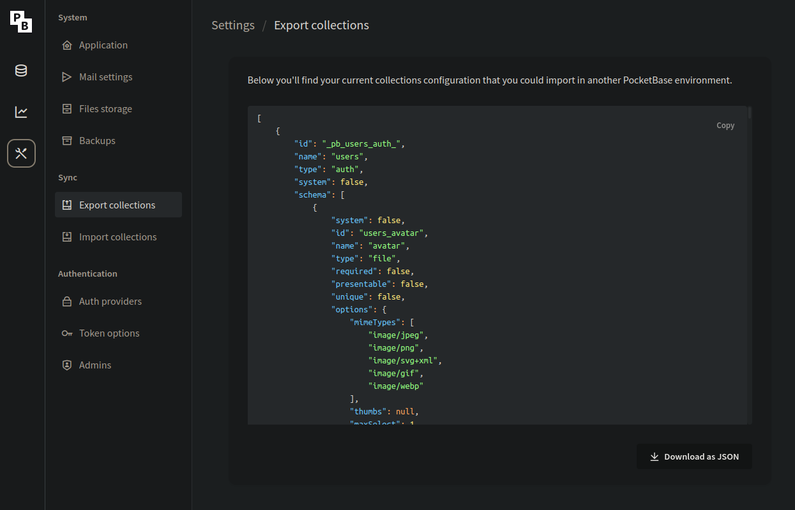
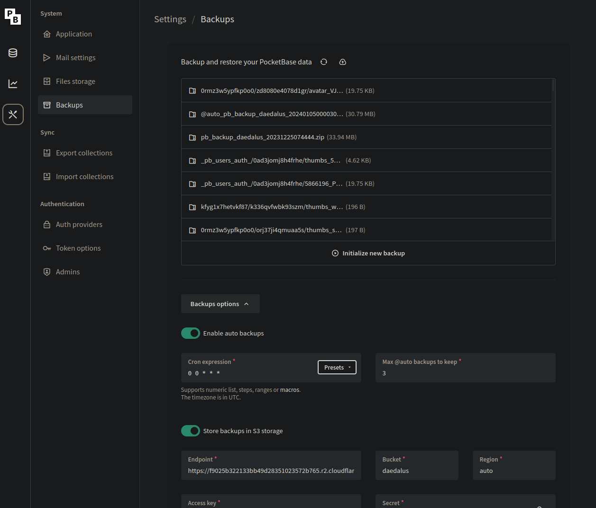

## Vercel

### Deployment

We did not need to instal lthe [vercel adapter](https://kit.svelte.dev/docs/adapter-vercel) as we didn't feel the need to use most of what their platform offers, e.g analytics, db, kv etc ...

Vercel is as straightforward as other cloud platforms we only need to link the repository, set the domains and environment variables, we can do further by auto previews on each PR made, but our repository is on an organization the actual linked repository is at one of our personal github accounts.

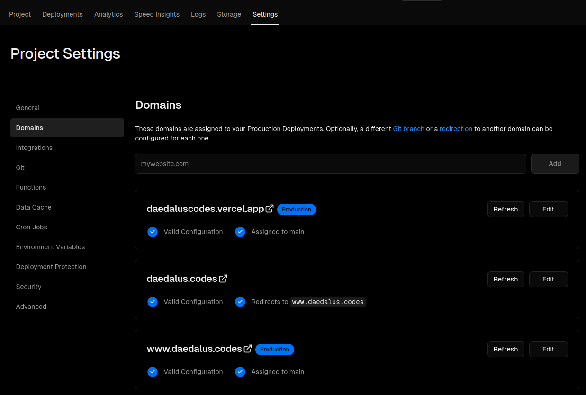
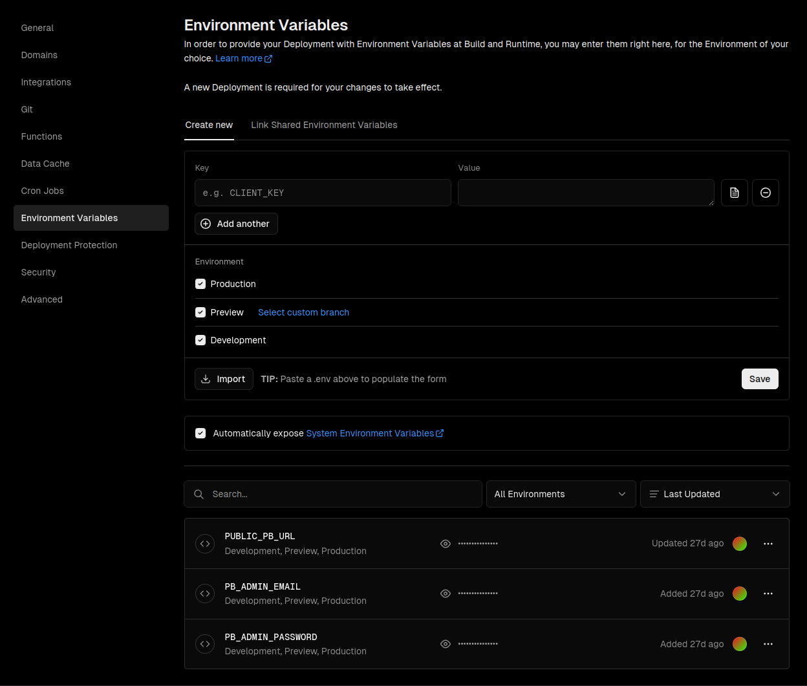

## Self Hosting and Development

## Self Hosting and Development

### Development

#### Install dependencies

1. Download [pocketbase](https://pocketbase.io/docs/) runtime depending on your OS.
   paste it on the `pb` directory;

2. You don't need to touch that directory.

3. After downloading try running `pnpm run dev:api`

4. If successful initialize your instance by going at `http://localhost:8090/_/`

   1. Copy the `.env.example` to `.env.development`

      ```sh
      cp .env.example .env.development
      ```

   2. Whatever you put in the installer setup should also be in your
      `.env.development` credentials

5. Use the sample data just upload the `sampledata.zip` located at
   `pb` directory to your local pb instance at [Backups](http://127.0.0.1:8090/_/#/settings/backups)

6. You local data that you have will stay with you as `pb/pb_data` is `gitignored`
   This will keep our production data pristine

7. You can now install node dependencies using `pnpm install`

8. On a seperate terminal run the ff commands on each one
   `pnpm dev:api` and `pnpm dev:web`

9. In case you are lazy run both using `pnpm dev` but some systems
   might not support closing each child process.

10. Contribute and make a PR.

For further questions reachout with the team

todo: self hosting guide

